# KenMatch DeepWiki &mdash; Merged Export

> Auto-exported from the [KenMatch DeepWiki](https://app.devin.ai/org/lowestprime/wiki/lowestprime/KenMatch).  
> Source repository: **lowestprime/KenMatch**

## Table of Contents

- [1 KenMatch Overview](#1-kenmatch-overview)
  - [1.1 Core Concepts and Terminology](#11-core-concepts-and-terminology)
  - [1.2 System Architecture Overview](#12-system-architecture-overview)
- [2 Data Layer and Persistence](#2-data-layer-and-persistence)
  - [2.1 Database Schema and Hydration](#21-database-schema-and-hydration)
  - [2.2 Seed Data and Demo Environment](#22-seed-data-and-demo-environment)
- [3 Business Logic Libraries](#3-business-logic-libraries)
  - [3.1 Allocation and Quadratic Voting Engine](#31-allocation-and-quadratic-voting-engine)
  - [3.2 Attestation and Participation Policy](#32-attestation-and-participation-policy)
  - [3.3 Economics and Treasury Logic](#33-economics-and-treasury-logic)
  - [3.4 Session Management and Environment Configuration](#34-session-management-and-environment-configuration)
- [4 Application Routes and Server Actions](#4-application-routes-and-server-actions)
  - [4.1 Home, Ken Board, and Ken Detail Pages](#41-home-ken-board-and-ken-detail-pages)
  - [4.2 Governance, Economics, and Submit Pages](#42-governance-economics-and-submit-pages)
  - [4.3 Authentication Routes and Server Actions](#43-authentication-routes-and-server-actions)
- [5 UI Components](#5-ui-components)
  - [5.1 Layout and Navigation Components](#51-layout-and-navigation-components)
  - [5.2 Ken Board and Detail Components](#52-ken-board-and-detail-components)
  - [5.3 Proposal Form and Auth Components](#53-proposal-form-and-auth-components)
- [6 Testing](#6-testing)
  - [6.1 Allocation and Attestation Tests](#61-allocation-and-attestation-tests)
  - [6.2 Economics Tests](#62-economics-tests)
- [7 Deployment and Infrastructure](#7-deployment-and-infrastructure)
  - [7.1 Docker Build and Synology NAS Deployment](#71-docker-build-and-synology-nas-deployment)
  - [7.2 Next.js Configuration and Security Headers](#72-nextjs-configuration-and-security-headers)
- [8 Glossary](#8-glossary)

---

# 1 KenMatch Overview

Relevant source files

The following files were used as context for generating this wiki page:

- [KenMatch_Conception.md](KenMatch_Conception.md)
- [README.md](README.md)
- [docs/architecture.md](docs/architecture.md)

KenMatch is a public coordination platform designed to democratize access to long-horizon, frontier-grade AI computation [README.md:2-5](). It provides a structured framework for proposing, ranking, funding, and auditing AI "Kens"—units of work that require sustained agentic effort over days, weeks, or months [README.md:11-12]().

The system moves beyond simple query-based interactions, treating continuous computation as a finite resource to be allocated through collective judgment rather than market power [KenMatch_Conception.md:41-44]().

## Mission and Purpose

The mission of KenMatch is to ensure that the most complex and high-value AI tasks—such as deep scientific research, software maintenance, and public-interest analysis—receive the necessary "agentic runtime" based on transparently resolved social value [README.md:5-7](), [README.md:41-49]().

Key objectives include:
*   **Democratic Ranking**: Using Quadratic Voting to allow users to express preference intensity while preventing "pay-to-win" dynamics [README.md:69-82]().
*   **Legible Funding**: Tracking treasury flows, sponsor pools, and revenue without allowing financial contribution to directly purchase rank [README.md:31-38]().
*   **Operational Transparency**: Providing audit trails, checkpoint gates, and safety status for all active runs [README.md:22-30]().

## Key Concepts

KenMatch introduces several domain-specific concepts to manage the lifecycle of long-running AI tasks:

*   **Kens (Tasks)**: The primary unit of work. Internally referred to as `tasks` in the schema [docs/architecture.md:43](), a Ken defines a goal, requested duration (lane), and deliverables [README.md:11-12]().
*   **Lanes**: Duration-based tiers for computation: **Months** (Top 3), **Weeks** (Top 10), and **Days** (Top 100) per category [README.md:89-96]().
*   **Voice Credits**: Scarce allocation rights earned through contribution, used for quadratic voting on Kens [README.md:53-67]().
*   **Pulse**: Fast, public signal (upvotes/downvotes) separate from the scarce allocation voice [README.md:14-17]().
*   **Attestation**: A sybil-resistance layer that determines a profile's participation limits and voice multipliers [docs/architecture.md:64]().

For a full breakdown of these terms and their implementation, see **[Core Concepts and Terminology](#1.1)**.

## System Architecture

KenMatch is built as a modern **Next.js 16 App Router** application [docs/architecture.md:5](). It uses **libSQL** for persistence, supporting both local file-based SQLite and remote instances [docs/architecture.md:8]().

### Subsystem Interaction

The system is divided into functional modules that bridge the gap between user intent (Natural Language Space) and system state (Code Entity Space).

**Diagram 1: Request Flow and Data Persistence**
This diagram shows how a user's interaction with a Ken (Task) flows through the Next.js routing layer into the persistence engine.

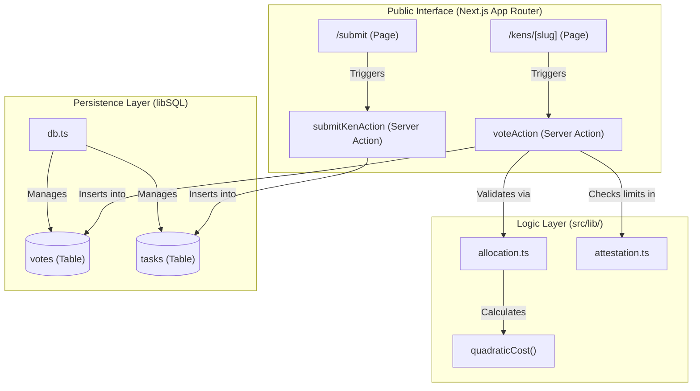
```mermaid
graph TD
    subgraph "Public Interface (Next.js App Router)"
        A["/kens/[slug] (Page)"] -- "Triggers" --> B["voteAction (Server Action)"]
        C["/submit (Page)"] -- "Triggers" --> D["submitKenAction (Server Action)"]
    end

    subgraph "Logic Layer (src/lib/)"
        B -- "Validates via" --> E["allocation.ts"]
        B -- "Checks limits in" --> F["attestation.ts"]
        E -- "Calculates" --> G["quadraticCost()"]
    end

    subgraph "Persistence Layer (libSQL)"
        B -- "Inserts into" --> H[("votes (Table)")]
        D -- "Inserts into" --> I[("tasks (Table)")]
        J["db.ts"] -- "Manages" --> H
        J -- "Manages" --> I
    end
```
**Sources:** [docs/architecture.md:12-35](), [docs/architecture.md:89-92](), [docs/architecture.md:43-45]()

**Diagram 2: Governance and Economics Relationship**
This diagram illustrates how the system balances financial inputs with governance outputs.

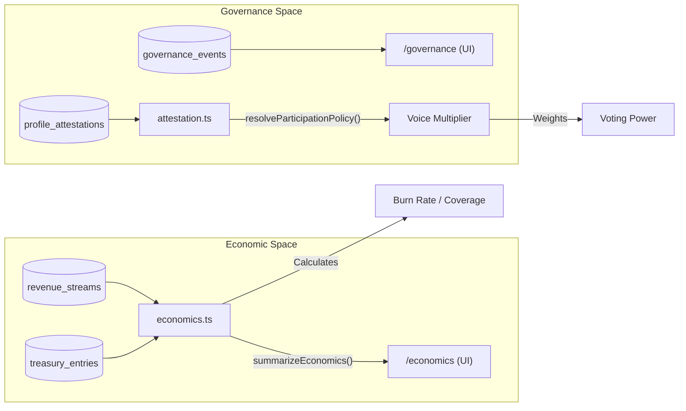
```mermaid
graph LR
    subgraph "Economic Space"
        A[("revenue_streams")] --> B["economics.ts"]
        C[("treasury_entries")] --> B
        B -- "summarizeEconomics()" --> D["/economics (UI)"]
    end

    subgraph "Governance Space"
        E[("profile_attestations")] --> F["attestation.ts"]
        G[("governance_events")] --> H["/governance (UI)"]
        F -- "resolveParticipationPolicy()" --> I["Voice Multiplier"]
    end

    I -- "Weights" --> J["Voting Power"]
    B -- "Calculates" --> K["Burn Rate / Coverage"]
```
**Sources:** [docs/architecture.md:22-25](), [docs/architecture.md:54-57](), [docs/architecture.md:61-64]()

For details on the technical stack and module relationships, see **[System Architecture Overview](#1.2)**.

## Documentation Map

*   **[Core Concepts and Terminology](#1.1)**: Deep dive into Kens, Lanes, Pulse, and Attestation.
*   **[System Architecture Overview](#1.2)**: Detailed look at the Next.js structure, libSQL strategy, and module boundaries.
*   **[Data Layer and Persistence](#2)**: Schema definitions, hydration pipelines, and seeding.
*   **[Business Logic Libraries](#3)**: Quadratic voting engines, attestation policies, and economic summaries.
*   **[Application Routes and Server Actions](#4)**: Page-by-page breakdown and mutation logic.
*   **[UI Components](#5)**: The React component library and theming system.
*   **[Testing](#6)**: Test suites for allocation, attestation, and economics.
*   **[Deployment and Infrastructure](#7)**: Docker, Synology NAS setup, and security headers.
*   **[Glossary](#8)**: Quick reference for all domain terms.

---

---

# 1.1 Core Concepts and Terminology

Relevant source files

The following files were used as context for generating this wiki page:

- [README.md](README.md)
- [docs/requirements-traceability.md](docs/requirements-traceability.md)
- [src/lib/types.ts](src/lib/types.ts)

This page defines the foundational domain vocabulary and technical concepts of the KenMatch platform. It maps high-level product language to specific implementation details, data structures, and logic within the codebase.

## Kens and Tasks

A **Ken** is the primary unit of work in KenMatch. It represents a proposed long-horizon AI task requiring sustained computation [README.md:2-5](). In the codebase, Kens are primarily represented by the `TaskRecord` interface and the `tasks` table [src/lib/types.ts:105-126]().

| Term | Code Entity | Description |
| :--- | :--- | :--- |
| **Ken** | `TaskRecord` | The public-facing name for a project proposal. |
| **Task** | `tasks` (DB Table) | The internal database identifier for a Ken [docs/requirements-traceability.md:68-70](). |
| **Stage** | `TaskStage` | The lifecycle state: `review`, `voting`, `scheduled`, `running`, `shipped`, or `blocked` [src/lib/types.ts:7-8](). |
| **Category** | `CategoryRecord` | The thematic grouping (e.g., "creative-works", "scientific-research") [src/lib/types.ts:55-61](). |

**Sources:** [README.md:11-12](), [src/lib/types.ts:7-8, 105-126](), [docs/requirements-traceability.md:68-70]()

## Allocation and Duration Tiers

KenMatch organizes work into explicit **Duration Tiers** (Lanes). Because frontier model compute is a finite resource, Kens compete for specific time-bound allocations [README.md:87-89]().

### Tier Logic
The system uses a tiered ranking system defined in `src/lib/allocation.ts`. Projects are ranked by their quadratic vote totals within their category.
*   **Months**: Top 3 projects per category [README.md:91]().
*   **Weeks**: Top 10 projects per category [README.md:93]().
*   **Days**: Top 100 projects per category [README.md:95]().

### Code Mapping: Tiers
The `AllocationTier` type includes `months`, `weeks`, `days`, `queued`, and `blocked` [src/lib/types.ts:4-5](). The function `tierForRank()` in `src/lib/allocation.ts` maps a numerical rank to these tiers based on the constants `MAX_MONTHS_RANK` and `MAX_WEEKS_RANK`.

**Sources:** [README.md:87-96](), [src/lib/types.ts:1-5](), [src/lib/allocation.ts:101-110]()

## Voice Credits and Quadratic Voting

KenMatch distinguishes between "Public Signal" (Pulse) and "Scarce Allocation Voice" (Quadratic Voting) [README.md:15-18]().

### Quadratic Voting (QV)
The cost to influence a Ken's rank grows quadratically relative to the number of votes cast by a single profile.
*   **Formula**: $\text{Cost} = \text{Votes}^2$ [README.md:81-82]().
*   **Implementation**: `quadraticCost(votes: number)` calculates the total credits required for a specific vote count [src/lib/allocation.ts:12-14]().
*   **Incremental Cost**: `incrementalQuadraticCost(currentVotes: number, additional: number)` calculates the cost to add more votes to an existing position [src/lib/allocation.ts:16-19]().

### Pulse
Pulse represents simple upvote/downvote support without credit expenditure [README.md:17](). It is tracked via the `task_pulse_votes` table and the `PulseDirection` type (-1 or 1) [src/lib/types.ts:22-23, 146-152]().

**Sources:** [README.md:15-19, 81-82](), [src/lib/allocation.ts:12-19](), [src/lib/types.ts:22-23, 137-152]()

## Attestation and Participation Policy

To ensure sybil resistance and platform integrity, KenMatch uses **Attestations** to gate user capabilities [README.md:69-75]().

### Sybil Risk and Participation
Profiles are assigned a `SybilRiskBand` (`low`, `medium`, `high`) and an `AttestationStatus` (`verified`, `review`, `limited`) [src/lib/types.ts:40-44](). The function `resolveParticipationPolicy()` in `src/lib/attestation.ts` maps these signals to a `ParticipationState`:

1.  **Full**: Unrestricted voting and commenting.
2.  **Review-Limited**: Participation allowed but subject to moderation queues or caps.
3.  **Read-Only**: Profile cannot cast votes or post comments.

### Voice Multiplier
Verified profiles may receive a `voiceMultiplier` (e.g., 1.5x) that increases the impact of their credits without increasing the cost [src/lib/attestation.ts:40-60]().

**Sources:** [src/lib/types.ts:40-48, 78-86](), [src/lib/attestation.ts:25-60](), [docs/requirements-traceability.md:19-22]()

## Execution: Pulse, Checkpoints, and Gates

Once a Ken moves into the `running` stage, it is managed via `ComputeRunRecord` [src/lib/types.ts:172-182]().

*   **Pulse**: The real-time activity and sentiment surrounding a Ken, visualized in `TaskPulsePanel` [src/components/task-pulse-panel.tsx]().
*   **Checkpoint**: A scheduled milestone in a Ken's execution [src/lib/types.ts:206-213]().
*   **Checkpoint Gate**: A governance mechanism that requires an `approvalScore` to exceed a `requiredApprovals` threshold before the run can proceed to the next phase [src/lib/types.ts:215-220]().

**Sources:** [src/lib/types.ts:172-220](), [docs/requirements-traceability.md:28-35]()

## Entity Mapping: Product to Code

The following diagrams illustrate how product concepts map to specific code entities and database structures.

### Diagram: Voting and Allocation Flow
This diagram shows how a user's "Voice" is converted into a "Tier" through the allocation engine.

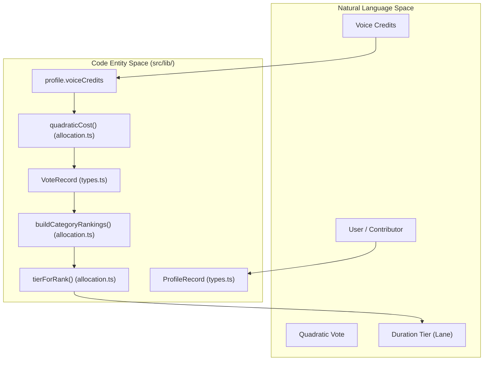
```mermaid
graph TD
    subgraph "Natural Language Space"
        User["User / Contributor"]
        Voice["Voice Credits"]
        Vote["Quadratic Vote"]
        Lane["Duration Tier (Lane)"]
    end

    subgraph "Code Entity Space (src/lib/)"
        Profile["ProfileRecord (types.ts)"]
        CreditVal["profile.voiceCredits"]
        QV_Engine["quadraticCost() (allocation.ts)"]
        VoteRec["VoteRecord (types.ts)"]
        Ranker["buildCategoryRankings() (allocation.ts)"]
        TierCalc["tierForRank() (allocation.ts)"]
    end

    User --> Profile
    Voice --> CreditVal
    CreditVal --> QV_Engine
    QV_Engine --> VoteRec
    VoteRec --> Ranker
    Ranker --> TierCalc
    TierCalc --> Lane
```
**Sources:** [src/lib/types.ts:63-76, 137-144](), [src/lib/allocation.ts:12-14, 55-110]()

### Diagram: Execution and Governance
This diagram shows the relationship between a running Ken and its safety/oversight mechanisms.

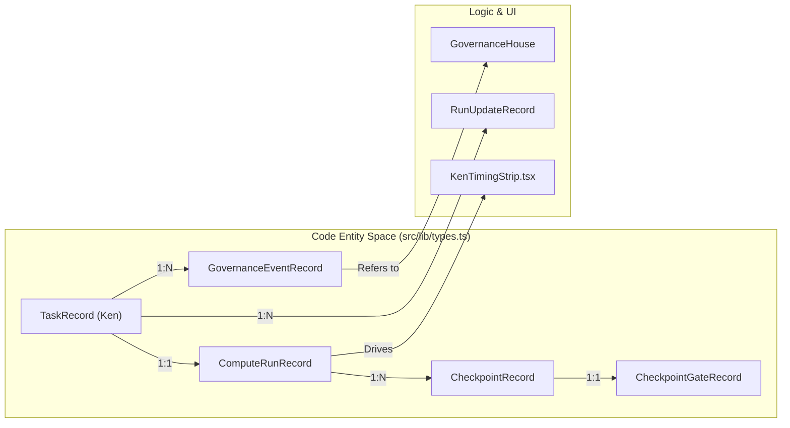
```mermaid
graph LR
    subgraph "Code Entity Space (src/lib/types.ts)"
        Task["TaskRecord (Ken)"]
        Run["ComputeRunRecord"]
        CP["CheckpointRecord"]
        Gate["CheckpointGateRecord"]
        Gov["GovernanceEventRecord"]
    end

    subgraph "Logic & UI"
        Timing["KenTimingStrip.tsx"]
        Audit["RunUpdateRecord"]
        House["GovernanceHouse"]
    end

    Task -- "1:1" --> Run
    Run -- "1:N" --> CP
    CP -- "1:1" --> Gate
    Task -- "1:N" --> Audit
    Task -- "1:N" --> Gov
    Gov -- "Refers to" --> House
    Run -- "Drives" --> Timing
```
**Sources:** [src/lib/types.ts:105-126, 172-230](), [src/components/ken-timing-strip.tsx]()

## Economics and Treasury

KenMatch maintains financial transparency through the `Economics` module.

*   **Revenue Stream**: A recurring source of funds (e.g., "enterprise", "sponsorship") [src/lib/types.ts:232-244]().
*   **Treasury Entry**: An individual ledger item representing an `inflow` or `outflow` [src/lib/types.ts:246-255]().
*   **Coverage Months**: A calculated metric in `summarizeEconomics()` that determines how long the current treasury can sustain the burn rate [src/lib/economics.ts:80-100]().

**Sources:** [src/lib/types.ts:25-32, 232-255](), [src/lib/economics.ts:80-115]()

---

---

# 1.2 System Architecture Overview

Relevant source files

The following files were used as context for generating this wiki page:

- [docs/architecture.md](docs/architecture.md)
- [docs/requirements-traceability.md](docs/requirements-traceability.md)
- [src/lib/db.ts](src/lib/db.ts)

This page describes the technical architecture of KenMatch, a platform for allocating resources to long-running AI work ("Kens"). The system is built on **Next.js 16** using the **App Router**, leveraging a **libSQL** (SQLite-compatible) persistence layer and a modular library structure for core business logic.

## High-Level Component Interaction

KenMatch is designed as a monolithic Next.js application where the boundary between public signal (Pulse) and scarce allocation (Voice) is enforced at the logic layer. The architecture follows a "Server-First" approach, utilizing Server Components for data fetching and Server Actions for mutations.

### Component-to-Code Mapping
The following diagram maps high-level system concepts to their specific implementations in the codebase.

**KenMatch System Map**
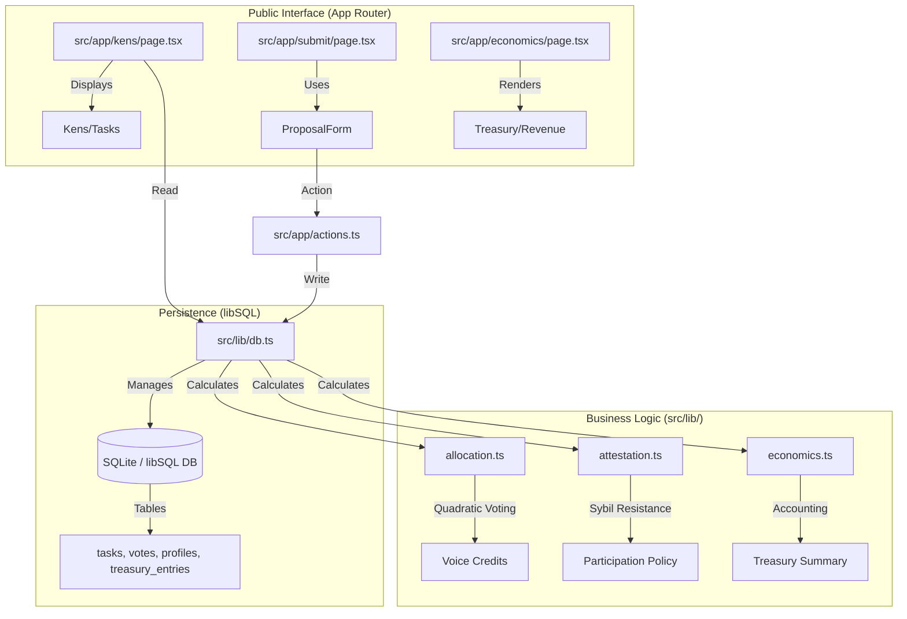
```mermaid
graph TD
    subgraph "Public Interface (App Router)"
        A["src/app/kens/page.tsx"] -- "Displays" --> B["Kens/Tasks"]
        C["src/app/submit/page.tsx"] -- "Uses" --> D["ProposalForm"]
        E["src/app/economics/page.tsx"] -- "Renders" --> F["Treasury/Revenue"]
    end

    subgraph "Business Logic (src/lib/)"
        G["allocation.ts"] -- "Quadratic Voting" --> H["Voice Credits"]
        I["attestation.ts"] -- "Sybil Resistance" --> J["Participation Policy"]
        K["economics.ts"] -- "Accounting" --> L["Treasury Summary"]
    end

    subgraph "Persistence (libSQL)"
        M["src/lib/db.ts"] -- "Manages" --> N[("SQLite / libSQL DB")]
        N -- "Tables" --> O["tasks, votes, profiles, treasury_entries"]
    end

    D -- "Action" --> P["src/app/actions.ts"]
    P -- "Write" --> M
    A -- "Read" --> M
    M -- "Calculates" --> G
    M -- "Calculates" --> I
    M -- "Calculates" --> K
```
**Sources:** [docs/architecture.md:1-32](), [docs/requirements-traceability.md:5-50](), [src/lib/db.ts:205-350]()

---

## Next.js App Router Structure

The application uses the Next.js App Router to handle routing, layouts, and data fetching. It follows a pattern where `db.ts` acts as the central data access layer for all Server Components.

| Route | Purpose | Key File |
| :--- | :--- | :--- |
| `/` | Homepage metrics and featured Kens | `src/app/page.tsx` |
| `/kens` | Public board with filters | `src/app/kens/page.tsx` |
| `/kens/[slug]` | Deep-dive Ken detail and voting | `src/app/kens/[slug]/page.tsx` |
| `/governance` | Attestation ladder and blocked Kens | `src/app/governance/page.tsx` |
| `/economics` | Treasury and revenue stream tracking | `src/app/economics/page.tsx` |
| `/submit` | Ken intake with tier-aware guidance | `src/app/submit/page.tsx` |
| `/api/health` | Deployment health probe | `src/app/api/health/route.ts` |

**Sources:** [docs/architecture.md:12-31](), [docs/requirements-traceability.md:7-9]()

---

## Data Flow: Public Signal vs. Scarce Allocation

A core architectural requirement is the separation of "Pulse" (public sentiment) from "Voice" (resource allocation). This prevents public popularity from automatically triggering resource expenditure.

**Signal vs. Allocation Flow**
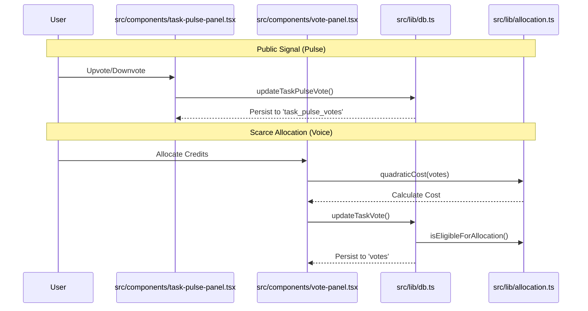
```mermaid
sequenceDiagram
    participant U as User
    participant P as src/components/task-pulse-panel.tsx
    participant V as src/components/vote-panel.tsx
    participant DB as src/lib/db.ts
    participant AL as src/lib/allocation.ts

    Note over U, AL: Public Signal (Pulse)
    U->>P: Upvote/Downvote
    P->>DB: updateTaskPulseVote()
    DB-->>P: Persist to 'task_pulse_votes'

    Note over U, AL: Scarce Allocation (Voice)
    U->>V: Allocate Credits
    V->>AL: quadraticCost(votes)
    AL-->>V: Calculate Cost
    V->>DB: updateTaskVote()
    DB->>AL: isEligibleForAllocation()
    DB-->>V: Persist to 'votes'
```

*   **Pulse:** Non-scarce upvotes/downvotes stored in `task_pulse_votes` [src/lib/db.ts:289-301]().
*   **Voice:** Quadratic voting using scarce `voiceCredits`. Logic is defined in `src/lib/allocation.ts` [src/lib/allocation.ts:43-52]() and enforced during the database update [src/lib/db.ts:1140-1170]().

**Sources:** [docs/architecture.md:59-65](), [docs/requirements-traceability.md:11-14](), [src/lib/db.ts:1140-1200]()

---

## Persistence Strategy: libSQL and SQLite

KenMatch uses `libSQL` for persistence, supporting both local file-based SQLite (for development/self-hosting) and remote Turso instances.

### Database Initialization and Hydration
The system uses a lazy-initialization pattern. The `ensureDatabase()` function [src/lib/db.ts:121-127]() is called before any operation, ensuring tables exist and are seeded if necessary.

1.  **Schema Creation:** `initializeDatabase()` [src/lib/db.ts:204-350]() runs a batch of `CREATE TABLE IF NOT EXISTS` statements.
2.  **Seeding:** If the `profiles` table is empty, the system runs `seedDatabase()` [src/lib/db.ts:352-378](), which populates the DB with data from `seed.ts` and `seed-plus.ts`.
3.  **Connection Management:** A global client `__kenmatchDbClient` is maintained to prevent connection exhaustion in serverless environments [src/lib/db.ts:109-119]().

**Sources:** [src/lib/db.ts:84-127](), [src/lib/db.ts:204-378](), [docs/architecture.md:112-118]()

---

## Major Module Relationships

The `src/lib/` directory contains the core domain logic, decoupled from the UI components.

### 1. Allocation (`allocation.ts`)
Calculates quadratic costs and determines task ranking within specific lanes (Days, Weeks, Months).
*   **Key Functions:** `quadraticCost()` [src/lib/allocation.ts:43-45](), `buildCategoryRankings()` [src/lib/allocation.ts:115-165]().

### 2. Attestation (`attestation.ts`)
Converts raw profile data and sybil signals into a `ParticipationPolicy`.
*   **Key Function:** `resolveParticipationPolicy()` [src/lib/attestation.ts:42-88]() determines if a user has `full`, `review-limited`, or `read-only` access.

### 3. Economics (`economics.ts`)
Handles treasury accounting and revenue stream projections.
*   **Key Function:** `summarizeEconomics()` [src/lib/economics.ts:112-160]() calculates burn rates and treasury coverage months.

### 4. DB Layer (`db.ts`)
The "God Object" that bridges the business logic and the persistence layer. It imports the logic from the modules above to return "Hydrated" records (e.g., a `TaskDetail` that includes its allocation rank and funding status).

**Internal Module Dependency Graph**
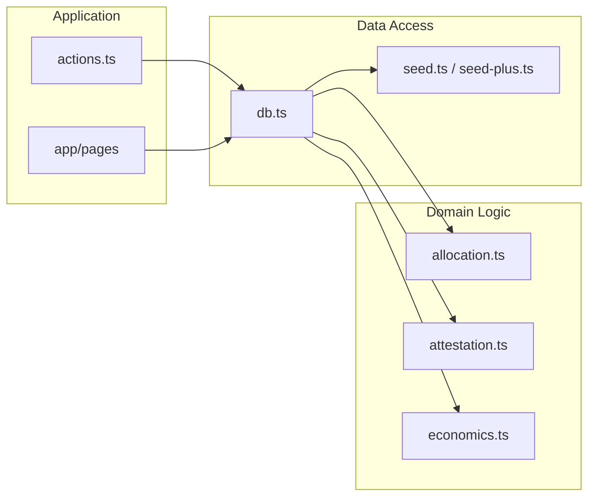
```mermaid
graph LR
    subgraph "Domain Logic"
        AL["allocation.ts"]
        AT["attestation.ts"]
        EC["economics.ts"]
    end

    subgraph "Data Access"
        DB["db.ts"]
        SD["seed.ts / seed-plus.ts"]
    end

    subgraph "Application"
        SA["actions.ts"]
        PG["app/pages"]
    end

    DB --> AL
    DB --> AT
    DB --> EC
    DB --> SD
    SA --> DB
    PG --> DB
```

**Sources:** [src/lib/db.ts:19-30](), [docs/architecture.md:33-58](), [docs/requirements-traceability.md:19-24]()

---

---

# 2 Data Layer and Persistence

Relevant source files

The following files were used as context for generating this wiki page:

- [src/lib/db.ts](src/lib/db.ts)
- [src/lib/types.ts](src/lib/types.ts)

KenMatch utilizes a lightweight yet robust persistence layer built on **libSQL** (a contribution-friendly fork of SQLite). The data architecture is designed for high-speed local development and efficient production hosting, using a single-file database approach that simplifies deployment while providing full relational capabilities.

## Persistence Strategy

The application interacts with the database through the `libSQL` client, supporting both local file-based storage and remote connections via `DATABASE_URL` [src/lib/db.ts:84-85](). 

### Client Initialization
The database client is managed as a global singleton to prevent connection exhaustion during Next.js hot reloads [src/lib/db.ts:93-119](). It employs a "lazy-init" pattern where the schema is verified and the connection is established only upon the first request via `ensureDatabase()` [src/lib/db.ts:121-127]().

### Data Flow Overview
The following diagram illustrates the relationship between the persistence layer and the application's runtime entities.

**Persistence to Code Entity Mapping**
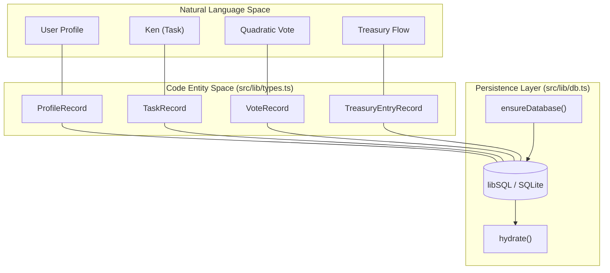
```mermaid
graph TD
    subgraph NaturalLanguageSpace["Natural Language Space"]
        UserProfile["User Profile"]
        KenTask["Ken (Task)"]
        QuadraticVote["Quadratic Vote"]
        TreasuryFlow["Treasury Flow"]
    end

    subgraph CodeEntitySpace["Code Entity Space (src/lib/types.ts)"]
        ProfileRecord["ProfileRecord"]
        TaskRecord["TaskRecord"]
        VoteRecord["VoteRecord"]
        TreasuryEntryRecord["TreasuryEntryRecord"]
    end

    subgraph PersistenceLayer["Persistence Layer (src/lib/db.ts)"]
        LibSQL[("libSQL / SQLite")]
        EnsureDB["ensureDatabase()"]
        Hydrate["hydrate()"]
    end

    UserProfile --- ProfileRecord
    KenTask --- TaskRecord
    QuadraticVote --- VoteRecord
    TreasuryFlow --- TreasuryEntryRecord

    ProfileRecord --- LibSQL
    TaskRecord --- LibSQL
    VoteRecord --- LibSQL
    TreasuryEntryRecord --- LibSQL

    EnsureDB --> LibSQL
    LibSQL --> Hydrate
```
**Sources:** [src/lib/db.ts:121-127](), [src/lib/types.ts:63-255]()

---

## Database Schema and Hydration

The system manages approximately 17 tables that track the entire lifecycle of a "Ken" (Task), from proposal and voting to compute execution and treasury settlement. 

- **Relational Integrity**: The schema uses strict foreign key constraints (e.g., `tasks` link to `categories` and `profiles`) [src/lib/db.ts:208-257]().
- **The Hydration Pipeline**: Because KenMatch performs complex calculations (like Quadratic Voting rankings and Treasury burn rates), it uses a `hydrate()` function. This pipeline fetches raw rows and transforms them into rich, computed objects like `EconomicsSummary` or `TaskDetail` [src/lib/db.ts:804-830]().

For a deep dive into the table structures and the transformation logic, see **[Database Schema and Hydration](#2.1)**.

**Sources:** [src/lib/db.ts:204-450](), [src/lib/db.ts:804-830]()

---

## Seeding and Development Environment

KenMatch includes a sophisticated two-tier seeding strategy to ensure developers and stakeholders can interact with a "warm" system that reflects real-world state.

| Tier | File | Purpose |
| :--- | :--- | :--- |
| **Base Seed** | `seed.ts` | Populates core structural data: Categories, Profiles, and basic Tasks [src/lib/seed.ts:1-39](). |
| **Plus Seed** | `seed-plus.ts` | Simulates activity: Votes, Attestations, Treasury entries, and Checkpoint gates [src/lib/seed-plus.ts:1-51](). |

This strategy allows the application to demonstrate complex states, such as tasks being "blocked" by governance or treasury funds being "restricted" to specific categories.

For details on how to trigger seeding and the specific scenarios modeled, see **[Seed Data and Demo Environment](#2.2)**.

**Sources:** [src/lib/db.ts:31-51](), [src/lib/db.ts:452-540]()

---

## Data Access Patterns

The codebase avoids complex ORMs in favor of typed SQL execution. This ensures maximum transparency and performance for the technical audience.

**Database Interaction Flow**
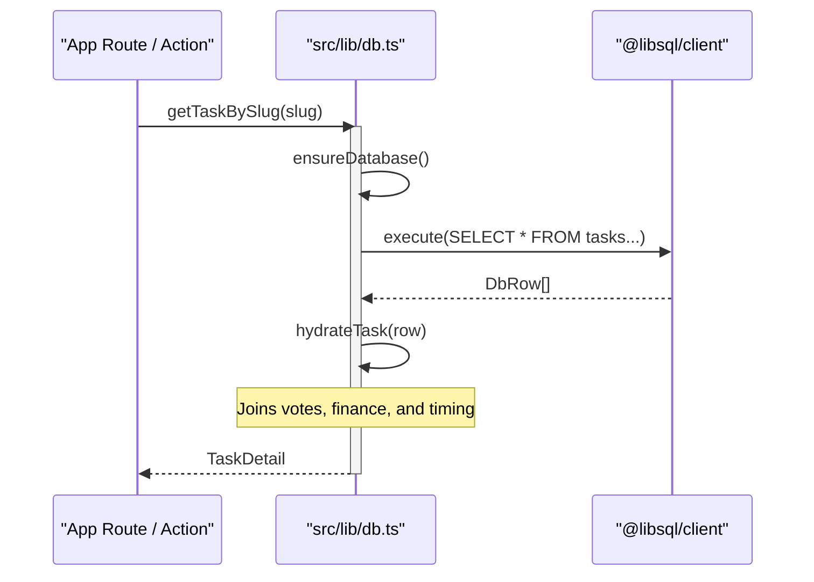
```mermaid
sequenceDiagram
    participant UI as "App Route / Action"
    participant DB as "src/lib/db.ts"
    participant LibSQL as "@libsql/client"

    UI->>DB: getTaskBySlug(slug)
    activate DB
    DB->>DB: ensureDatabase()
    DB->>LibSQL: execute(SELECT * FROM tasks...)
    LibSQL-->>DB: DbRow[]
    DB->>DB: hydrateTask(row)
    Note over DB: Joins votes, finance, and timing
    DB-->>UI: TaskDetail
    deactivate DB
```

### Key Utility Functions
- `execute(sql, args)`: The primary wrapper for running queries [src/lib/db.ts:184-187]().
- `batch(statements)`: Used for atomic transactions, especially during initialization and seeding [src/lib/db.ts:189-192]().
- `loadRows(sql, args)`: Helper to return typed result sets [src/lib/db.ts:194-197]().

**Sources:** [src/lib/db.ts:184-202](), [src/lib/db.ts:634-650]()

---

---

# 2.1 Database Schema and Hydration

Relevant source files

The following files were used as context for generating this wiki page:

- [src/lib/db.ts](src/lib/db.ts)
- [src/lib/types.ts](src/lib/types.ts)

This page provides a technical deep dive into the KenMatch persistence layer, implemented using libSQL (SQLite). It covers the 17-table relational schema, the lazy-initialization pattern for database connectivity, and the hydration pipeline that transforms raw database rows into rich, in-memory application snapshots.

## Persistence Architecture

KenMatch uses a libSQL client to manage a local SQLite database file or a remote Turso instance. The system follows a "lazy-init" pattern where the database connection and schema are only established upon the first query execution.

### Lazy Initialization Pattern

The `ensureDatabase()` function serves as the gatekeeper for all database interactions. It ensures that the directory exists, the client is configured, and the schema is applied before any operation proceeds.

| Function | Role | Source |
| :--- | :--- | :--- |
| `getClient()` | Singleton provider for the libSQL `Client`. Configures URL and Auth Token. | [src/lib/db.ts:109-119]() |
| `ensureDatabase()` | Idempotent wrapper that triggers `initializeDatabase()` once per process. | [src/lib/db.ts:121-127]() |
| `initializeDatabase()` | Executes `CREATE TABLE IF NOT EXISTS` statements and triggers seeding. | [src/lib/db.ts:204-436]() |

**Sources:** [src/lib/db.ts:109-127](), [src/lib/db.ts:204-436]()

## Database Schema

The schema consists of approximately 17 tables categorized into core entities (Profiles/Tasks), governance/voting mechanics, and economic tracking.

### Core Entity Relationship Diagram
This diagram maps the primary data structures defined in `src/lib/types.ts` to their database representations in `src/lib/db.ts`.

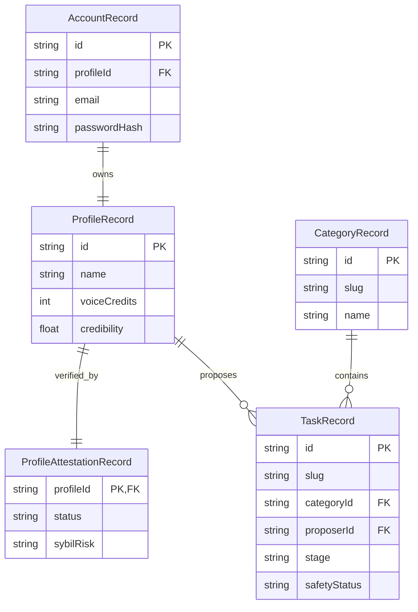
```mermaid
erDiagram
    "AccountRecord" {
        string id PK
        string profileId FK
        string email
        string passwordHash
    }
    "ProfileRecord" {
        string id PK
        string name
        int voiceCredits
        float credibility
    }
    "TaskRecord" {
        string id PK
        string slug
        string categoryId FK
        string proposerId FK
        string stage
        string safetyStatus
    }
    "CategoryRecord" {
        string id PK
        string slug
        string name
    }
    "ProfileAttestationRecord" {
        string profileId PK, FK
        string status
        string sybilRisk
    }

    "AccountRecord" ||--|| "ProfileRecord" : "owns"
    "ProfileRecord" ||--|| "ProfileAttestationRecord" : "verified_by"
    "ProfileRecord" ||--o{ "TaskRecord" : "proposes"
    "CategoryRecord" ||--o{ "TaskRecord" : "contains"
```
**Sources:** [src/lib/types.ts:55-126](), [src/lib/db.ts:209-278]()

### Table Definitions

| Table | Description | Key Fields |
| :--- | :--- | :--- |
| `profiles` | User identity and social capital. | `voiceCredits`, `credibility`, `attestationLevel` |
| `accounts` | Auth credentials and email mapping. | `passwordHash`, `passwordSalt` |
| `tasks` | The central "Ken" proposal. | `requestedTier`, `stage`, `safetyStatus` |
| `votes` | Quadratic voting allocations. | `voteCount`, `rationale` |
| `task_pulse_votes` | Binary sentiment (-1/1) signals. | `value` |
| `checkpoints` | Milestone tracking for running tasks. | `status`, `dueAt` |
| `checkpoint_gates` | Governance requirements for funding release. | `approvalScore`, `requiredApprovals` |
| `revenue_streams` | Sources of treasury inflow. | `monthlyRevenueUsd`, `treasurySharePercent` |
| `treasury_entries` | Ledger of all inflows and outflows. | `amountUsd`, `bucket`, `direction` |

**Sources:** [src/lib/db.ts:209-420](), [src/lib/types.ts:55-255]()

## The Hydration Pipeline

Hydration in KenMatch is the process of fetching raw relational data and applying business logic (such as Quadratic Voting calculations and Attestation policies) to produce a "Summary" or "Detail" object used by the UI.

### Logic Flow: Data to Snapshot
The following diagram illustrates how the `hydrate()` function in `src/lib/db.ts` transforms database rows into the application state.

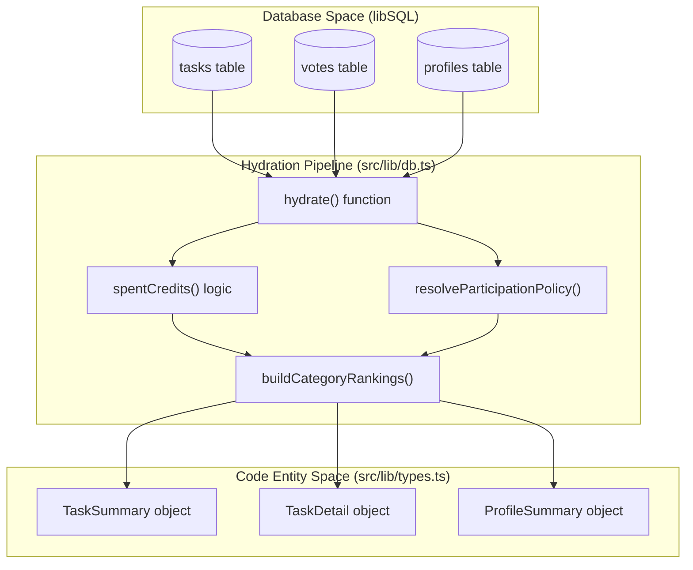
```mermaid
flowchart TD
    subgraph "Database Space (libSQL)"
        R1[("tasks table")]
        R2[("votes table")]
        R3[("profiles table")]
    end

    subgraph "Hydration Pipeline (src/lib/db.ts)"
        H["hydrate() function"]
        QV["spentCredits() logic"]
        AP["resolveParticipationPolicy()"]
        CR["buildCategoryRankings()"]
    end

    subgraph "Code Entity Space (src/lib/types.ts)"
        TS["TaskSummary object"]
        TD["TaskDetail object"]
        PS["ProfileSummary object"]
    end

    R1 & R2 & R3 --> H
    H --> QV
    H --> AP
    QV & AP --> CR
    CR --> TS & TD & PS
```
**Sources:** [src/lib/db.ts:466-608](), [src/lib/allocation.ts:101-140](), [src/lib/attestation.ts:27-52]()

### Key Hydration Functions

#### 1. `hydrate()`
The primary engine for building the in-memory state. It performs the following:
1.  **Joins**: Aggregates tasks with their proposer profiles and categories [src/lib/db.ts:474-500]().
2.  **Vote Aggregation**: Sums `voteCount` per task to determine allocation eligibility [src/lib/db.ts:511-525]().
3.  **Ranking**: Calls `buildCategoryRankings()` to sort tasks into "months", "weeks", "days", or "queued" tiers based on relative vote weight [src/lib/db.ts:560-580]().

#### 2. `getTaskDetail(slug, viewerProfileId)`
Builds a comprehensive view of a single task, including:
*   **Finance**: Joins `task_finance` for bond and budget data [src/lib/db.ts:684-690]().
*   **Timing**: Fetches `task_timings` for compute usage and end dates [src/lib/db.ts:691-695]().
*   **Governance**: Attaches `governance_events` related to the task [src/lib/db.ts:718-725]().

#### 3. `getViewerSession(token)`
Maps a session token to a `ProfileSummary`, which includes the `ParticipationState` (full, review-limited, or read-only) resolved via `resolveParticipationPolicy()` [src/lib/db.ts:1145-1170]().

**Sources:** [src/lib/db.ts:466-608](), [src/lib/db.ts:663-750](), [src/lib/db.ts:1145-1170]()

## Data Transformation Helpers

Since libSQL/SQLite has limited data types, `src/lib/db.ts` includes several utilities to handle serialization:

*   **List Serialization**: `serializeList()` and `parseList()` convert TypeScript string arrays to JSON strings for storage in `TEXT` columns (used for `deliverables`, `riskFlags`, etc.) [src/lib/db.ts:129-139]().
*   **Type Casting**: `getNumber()` and `getString()` provide safe extraction from `DbRow` objects, handling the conversion from libSQL `Value` types (which may be `bigint` or `number`) to standard TypeScript types [src/lib/db.ts:141-178]().

**Sources:** [src/lib/db.ts:129-178]()

---

---

# 2.2 Seed Data and Demo Environment

Relevant source files

The following files were used as context for generating this wiki page:

- [src/lib/seed-plus.ts](src/lib/seed-plus.ts)
- [src/lib/seed.ts](src/lib/seed.ts)

This page describes the two-tier seeding system used in KenMatch to create a rich, interactive development and testing environment. The system models the complete lifecycle of a **Ken** (Task), including proposal stages, quadratic voting allocation, treasury flows, and governance gates.

## Overview of the Two-Tier Seeding System

KenMatch uses two distinct seeding files to populate the database. This separation allows for a clean distinction between core structural data and the complex relational "pulse" data required to simulate a living ecosystem.

1.  **`seed.ts`**: Populates foundational entities: Profiles, Categories, Tasks, and historical Governance Events.
2.  **`seed-plus.ts`**: Populates high-fidelity simulation data: Attestations, Task Finances, Pulse Votes, Revenue Streams, and Checkpoint Gates.

### Data Flow and Initialization

The seeding process is typically triggered during database initialization. The `ensureDatabase()` function in `src/lib/db.ts` checks for an empty database and applies the schema followed by these seed sets.

**Natural Language to Code Entity Mapping: Seeding Architecture**

| Concept | Code Entity / File | Role |
| :--- | :--- | :--- |
| **Identity & Access** | `seedProfiles` [src/lib/seed.ts:3-11]() | Defines users with roles, specialties, and voice credits. |
| **Taxonomy** | `seedCategories` [src/lib/seed.ts:13-19]() | Defines the five core investment lanes (e.g., "Open Tools"). |
| **Core Work** | `seedTasks` [src/lib/seed.ts:21-25]() | Defines Kens with summaries, budget, and safety status. |
| **Trust Layer** | `seedProfileAttestations` [src/lib/seed-plus.ts:3-11]() | Links profiles to verification signals (ORCID, GitHub). |
| **Fiscal Health** | `seedTaskFinance` [src/lib/seed-plus.ts:13-25]() | Sets sponsor pools and enterprise packaging notes. |

Sources: [src/lib/seed.ts:1-25](), [src/lib/seed-plus.ts:1-25]()

---

## Modeling the Ken Lifecycle

The seed data is designed to showcase Kens at every stage of the pipeline, from "queued" to "shipped," including those blocked by governance.

### 1. Task States and Safety Gating
The `seedTasks` array includes examples of:
*   **Approved & Running**: `home-energy-upgrade-companion` [src/lib/seed.ts:22-22]().
*   **Shipped**: `repair-manual-finder` [src/lib/seed.ts:23-23]().
*   **Blocked/Prohibited**: `autonomous-phishing-lure-optimizer` [src/lib/seed.ts:25-25](). This task demonstrates the `safetyStatus: "blocked"` state, which prevents it from receiving funding or appearing in standard lists.

### 2. Allocation and Voting
To test the **Quadratic Voting (QV)** engine, `seedVotes` provides a distribution of voice credits across tasks.
*   **Voice Credits**: Profiles like `maya-chen` start with specific `voiceCredits` (e.g., 64) [src/lib/seed.ts:4-4]().
*   **Vote Distribution**: Votes are cast with varying `value` amounts to test the `quadraticCost` calculation in `src/lib/allocation.ts`.

### 3. Checkpoint Gates and Governance
The `seedCheckpointGates` in `seed-plus.ts` model the "Review-Triggered" gates required for a Ken to progress.
*   **Gate Types**: Includes `technical-review`, `safety-audit`, and `public-demo` [src/lib/seed-plus.ts:121-135]().
*   **Status**: Gates are marked as `pending`, `approved`, or `blocked`, allowing the UI to render the governance "ladder."

**Code Entity Interaction: Governance and Finance**

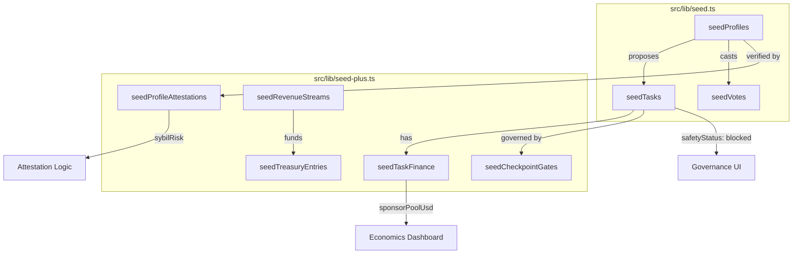
```mermaid
graph TD
    subgraph "src/lib/seed.ts"
        P["seedProfiles"] -->|proposes| T["seedTasks"]
        P -->|casts| V["seedVotes"]
    end

    subgraph "src/lib/seed-plus.ts"
        T -->|has| TF["seedTaskFinance"]
        T -->|governed by| CG["seedCheckpointGates"]
        P -->|verified by| PA["seedProfileAttestations"]
        RS["seedRevenueStreams"] -->|funds| TE["seedTreasuryEntries"]
    end

    T -- "safetyStatus: blocked" --> G["Governance UI"]
    TF -- "sponsorPoolUsd" --> E["Economics Dashboard"]
    PA -- "sybilRisk" --> AS["Attestation Logic"]
```

Sources: [src/lib/seed.ts:21-30](), [src/lib/seed-plus.ts:3-25](), [src/lib/seed-plus.ts:121-135]()

---

## Treasury and Economic Simulation

The `seed-plus.ts` file contains the logic for the "Demo Environment" economics, simulating how the platform sustains itself.

### Revenue Streams
The `seedRevenueStreams` array models different types of incoming capital:
*   **Sponsor Pools**: Large-scale funding for specific categories.
*   **Verified Streams**: Recurring revenue from enterprise packaging (e.g., `museum-oral-history-indexer` [src/lib/seed-plus.ts:22-22]()).
*   **Founder/Platform Split**: Streams define `founderShare` and `treasuryShare` to test the logic in `src/lib/economics.ts` [src/lib/seed-plus.ts:101-110]().

### Treasury Ledger
The `seedTreasuryEntries` provide a historical ledger of "Inflow" vs "Outflow" (Burn). This allows the `summarizeEconomics()` function to calculate:
*   **Current Balance**: Sum of all entries.
*   **Coverage Months**: How long the treasury can sustain current Ken runtimes based on simulated burn [src/lib/seed-plus.ts:112-119]().

| Entity | Key Fields | Purpose in Demo |
| :--- | :--- | :--- |
| `TaskFinanceRecord` | `checkpointApprovalTarget`, `sponsorPoolUsd` | Sets the bar for governance and funding depth. |
| `RevenueStreamRecord` | `status`, `amountMonthly`, `treasuryShare` | Simulates platform sustainability and burn rate. |
| `ProfileAttestationRecord` | `sybilRisk`, `signals` | Determines `voiceMultiplier` in `src/lib/attestation.ts`. |

Sources: [src/lib/seed-plus.ts:13-25](), [src/lib/seed-plus.ts:101-119]()

---

## Implementation Detail: Checkpoint Gates

A critical part of the demo environment is the **Checkpoint Gate** system. This models the friction and rigor required for high-stakes Kens.

*   **Gate Records**: Each record in `seedCheckpointGates` links a `taskId` to a specific `gateType` [src/lib/seed-plus.ts:121-125]().
*   **Blocking Logic**: In the demo, `autonomous-phishing-lure-optimizer` has a `blocked` gate with a `failureReason` ("Prohibited offensive security work"), which serves as the primary example for the Governance decision log [src/lib/seed-plus.ts:131-135]().

**Sequence: Data Hydration to UI**

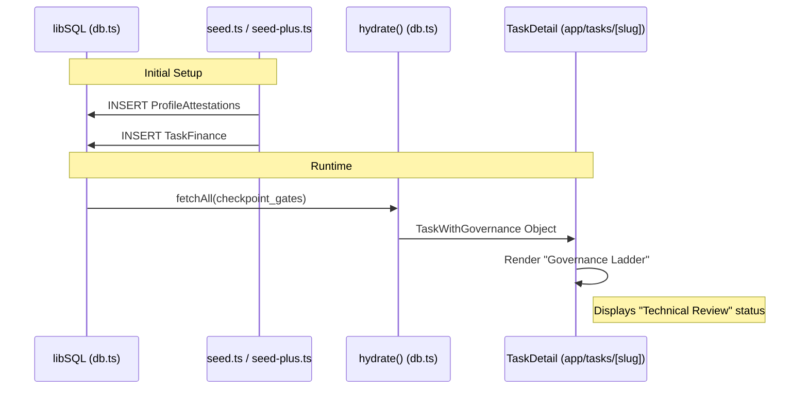
```mermaid
sequenceDiagram
    participant DB as libSQL (db.ts)
    participant Seed as seed.ts / seed-plus.ts
    participant Hydrate as hydrate() (db.ts)
    participant UI as TaskDetail (app/tasks/[slug])

    Note over DB, Seed: Initial Setup
    Seed->>DB: INSERT ProfileAttestations
    Seed->>DB: INSERT TaskFinance
    
    Note over DB, UI: Runtime
    DB->>Hydrate: fetchAll(checkpoint_gates)
    Hydrate->>UI: TaskWithGovernance Object
    UI->>UI: Render "Governance Ladder"
    Note right of UI: Displays "Technical Review" status
```

Sources: [src/lib/seed-plus.ts:121-135](), [src/lib/types.ts:1-20]() (for record types)

---

---

# 3 Business Logic Libraries

Relevant source files

The following files were used as context for generating this wiki page:

- [src/lib/allocation.ts](src/lib/allocation.ts)
- [src/lib/attestation.ts](src/lib/attestation.ts)
- [src/lib/economics.ts](src/lib/economics.ts)
- [src/lib/env.ts](src/lib/env.ts)
- [src/lib/session.ts](src/lib/session.ts)
- [src/lib/utils.ts](src/lib/utils.ts)

The modules located in `src/lib/` constitute the core "engine" of KenMatch. These libraries are designed as pure-function utilities that implement the platform's rulesets—ranging from quadratic voting math and sybil resistance policies to treasury accounting and session lifecycle management. By isolating this logic from React components and database drivers, the system ensures that critical business rules are testable and consistent across the server-side and client-side (where applicable).

### System Logic Mapping

The following diagram maps high-level platform concepts to the specific code entities that implement them.

**Logic to Entity Mapping**
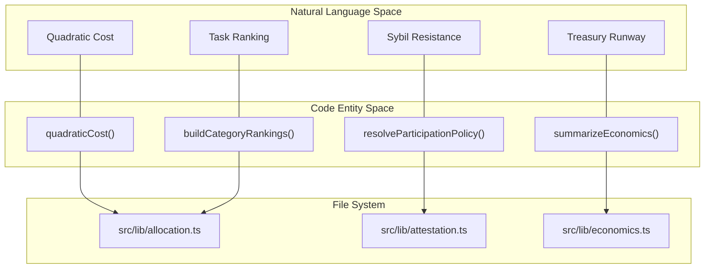
```mermaid
graph TD
    subgraph "Natural Language Space"
        A["Quadratic Cost"]
        B["Sybil Resistance"]
        C["Treasury Runway"]
        D["Task Ranking"]
    end

    subgraph "Code Entity Space"
        A1["quadraticCost()"]
        B1["resolveParticipationPolicy()"]
        C1["summarizeEconomics()"]
        D1["buildCategoryRankings()"]
    end

    A --- A1
    B --- B1
    C --- C1
    D --- D1

    subgraph "File System"
        A1 --> F1["src/lib/allocation.ts"]
        B1 --> F2["src/lib/attestation.ts"]
        C1 --> F3["src/lib/economics.ts"]
        D1 --> F1
    end
```
Sources: [src/lib/allocation.ts:5-11](), [src/lib/attestation.ts:14-18](), [src/lib/economics.ts:14-19]()

---

### [Allocation and Quadratic Voting Engine](#3.1)

The allocation engine governs how "Voice Credits" are converted into "Votes" and how those votes determine task priority. It enforces the quadratic cost rule where the cost of votes scales by the square of the count [src/lib/allocation.ts:5-11](). It also manages the tiering system (`months`, `weeks`, `days`) that dictates resource allocation based on a task's rank within its category [src/lib/allocation.ts:33-55]().

**Key Functions:**
- `quadraticCost(votes)`: Calculates $Cost = Votes^2$ [src/lib/allocation.ts:5-11]().
- `buildCategoryRankings(tasks)`: Groups tasks by category and assigns ranks based on vote totals and creation dates [src/lib/allocation.ts:72-113]().
- `isEligibleForAllocation(...)`: Determines if a task can move out of the queue based on its `TaskStage` and `SafetyStatus` [src/lib/allocation.ts:17-31]().

For details, see [Allocation and Quadratic Voting Engine](#3.1).

---

### [Attestation and Participation Policy](#3.2)

KenMatch uses an attestation-based system to mitigate Sybil attacks. The logic in `src/lib/attestation.ts` maps a user's `AttestationStatus` and `SybilRiskBand` to a `ParticipationPolicy` [src/lib/attestation.ts:14-18](). This policy defines whether a user can perform public actions like submitting Kens, commenting, or pulsing [src/lib/attestation.ts:3-12]().

**Participation States:**
- `full`: Unrestricted access [src/lib/attestation.ts:60-69]().
- `review-limited`: Reduced `voiceMultiplier` (e.g., 0.6 to 0.8) while identity signals are pending [src/lib/attestation.ts:32-58]().
- `read-only`: All public actions paused due to high risk or limited status [src/lib/attestation.ts:19-30]().

For details, see [Attestation and Participation Policy](#3.2).

---

### [Economics and Treasury Logic](#3.3)

The economics module processes revenue streams and treasury entries to provide a snapshot of the platform's financial health. It calculates "Coverage Months" (runway) by comparing the `treasuryBalanceUsd` against the `monthlyPublicBurnUsd` [src/lib/economics.ts:27-30]().

**Core Logic:**
- **Revenue Splitting**: Automatically calculates splits between the treasury and founders based on defined percentages [src/lib/economics.ts:3-12]().
- **Restricted Funding**: Identifies and isolates funds marked as "restricted" within the treasury [src/lib/economics.ts:31-33]().
- **Summary Generation**: Aggregates all streams into an `EconomicsSummary` object for the dashboard [src/lib/economics.ts:14-49]().

For details, see [Economics and Treasury Logic](#3.3).

---

### [Session Management and Environment Configuration](#3.4)

These libraries handle the "plumbing" of the application: environment validation and user sessions.

- **Environment (`env.ts`)**: Uses `zod` to validate all `process.env` variables, ensuring the app does not start with missing or malformed configuration [src/lib/env.ts:25-36]().
- **Sessions (`session.ts`)**: Manages the lifecycle of the `KENMATCH_SESSION_COOKIE`, providing utilities to get the current viewer's profile or clear the session on logout [src/lib/session.ts:18-42]().

**Session Interaction Flow**
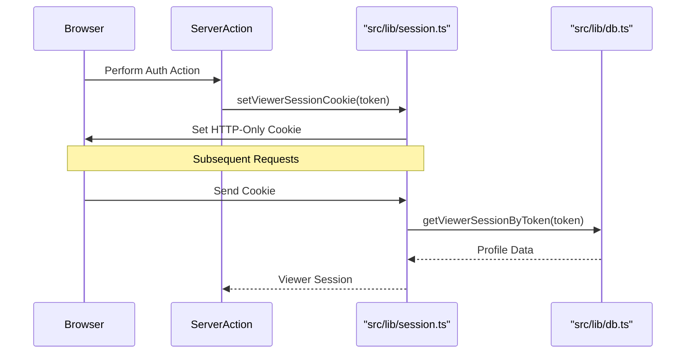
```mermaid
sequenceDiagram
    participant Browser
    participant ServerAction
    participant SessionLib as "src/lib/session.ts"
    participant DB as "src/lib/db.ts"

    Browser->>ServerAction: Perform Auth Action
    ServerAction->>SessionLib: setViewerSessionCookie(token)
    SessionLib->>Browser: Set HTTP-Only Cookie
    Note over Browser, SessionLib: Subsequent Requests
    Browser->>SessionLib: Send Cookie
    SessionLib->>DB: getViewerSessionByToken(token)
    DB-->>SessionLib: Profile Data
    SessionLib-->>ServerAction: Viewer Session
```
Sources: [src/lib/session.ts:18-22](), [src/lib/session.ts:29-32]()

For details, see [Session Management and Environment Configuration](#3.4).

---

---

# 3.1 Allocation and Quadratic Voting Engine

Relevant source files

The following files were used as context for generating this wiki page:

- [src/lib/allocation.ts](src/lib/allocation.ts)
- [tests/allocation.test.ts](tests/allocation.test.ts)

The Allocation and Quadratic Voting Engine, implemented primarily in `src/lib/allocation.ts`, is the core mathematical and logical component that determines how scarce resources (attention and funding) are distributed across Kens (tasks). It translates user preferences—expressed through Voice Credits—into a prioritized hierarchy of execution tiers.

## Quadratic Voting Logic

KenMatch employs Quadratic Voting (QV) to allow users to express the intensity of their preferences rather than just a binary "yes/no."

### Cost Functions
The system uses a power-of-two cost model where the cost in Voice Credits is the square of the number of votes cast on a single task [src/lib/allocation.ts:5-11]().

*   **`quadraticCost(votes: number)`**: Calculates the total cost for a given number of votes. For example, 3 votes cost 9 credits, while 6 votes cost 36 credits [src/lib/allocation.ts:5-11]().
*   **`incrementalQuadraticCost(currentVotes, nextVotes)`**: Determines the additional credits required to increase a vote count from an existing level to a new level [src/lib/allocation.ts:13-15]().
*   **`spentCredits(votes: Array<{ voteCount: number }>)`**: Aggregates the total credit expenditure across multiple tasks for a specific user profile [src/lib/allocation.ts:115-117]().

### Constraints
To prevent extreme concentration of influence, the system enforces a hard cap on individual task voting:
*   **`MAX_VOTES_PER_TASK`**: Set to `6` [src/lib/allocation.ts:3-3](). This means the maximum credits a user can spend on one task is 36.

## Task Eligibility and Ranking

Not all tasks are eligible to receive an allocation rank. The engine filters tasks based on their lifecycle stage and safety status before placing them on the "ladder."

### Eligibility Criteria
The function `isEligibleForAllocation()` determines if a task can enter the ranking process [src/lib/allocation.ts:17-31]().

| Condition | Eligibility | Reason |
| :--- | :--- | :--- |
| `stage` is "review" or "blocked" | `false` | Tasks in initial intake or explicitly halted cannot be ranked [src/lib/allocation.ts:22-24](). |
| `safetyStatus` is "pending" or "blocked" | `false` | Safety/Policy checks must be "approved" for allocation [src/lib/allocation.ts:26-28](). |
| `totalVotes` <= 0 | `false` | Tasks with no community support remain queued [src/lib/allocation.ts:30-30](). |

### The Ranking Pipeline
The `buildCategoryRankings()` function processes a list of `RankingSeed` objects to generate a map of results [src/lib/allocation.ts:72-113]().

1.  **Grouping**: Tasks are grouped by their `categoryId` [src/lib/allocation.ts:76-80]().
2.  **Sorting**: Within each category, eligible tasks are sorted by:
    *   `totalVotes` (Descending) [src/lib/allocation.ts:86-88]().
    *   `createdAt` (Ascending/Oldest first) as a tie-breaker [src/lib/allocation.ts:90-92]().
    *   `title` (Alphabetical) as a final tie-breaker [src/lib/allocation.ts:94-94]().
3.  **Assignment**: Ranks are assigned starting from 1 for the top-voted eligible task [src/lib/allocation.ts:97-100]().

**Sources:** [src/lib/allocation.ts:17-113](), [tests/allocation.test.ts:24-38]()

## Allocation Tiers

The system maps numerical ranks into human-readable "Tiers" that represent the velocity and resource commitment for a task.

### Tier Definitions
The `tierForRank()` function assigns a `AllocationTier` based on the task's position in its category [src/lib/allocation.ts:33-55]().

| Rank | Tier | Weight | Description |
| :--- | :--- | :--- | :--- |
| 1 - 3 | `months` | 3 | High priority; sustained long-term focus [src/lib/allocation.ts:42-44](). |
| 4 - 10 | `weeks` | 2 | Medium priority; active development [src/lib/allocation.ts:46-48](). |
| 11 - 100 | `days` | 1 | Low priority; intermittent progress [src/lib/allocation.ts:50-52](). |
| > 100 or Ineligible | `queued` | 0 | Backlog; waiting for votes or approval [src/lib/allocation.ts:54-54](). |
| Blocked | `blocked` | -1 | Explicitly halted by governance [src/lib/allocation.ts:34-36](). |

**Sources:** [src/lib/allocation.ts:33-55](), [src/lib/allocation.ts:119-132](), [tests/allocation.test.ts:16-22]()

## System Flow Diagrams

### Data Transformation: From Votes to Tiers
This diagram shows how the raw data entities (Votes and Tasks) are processed by the allocation functions to produce the final Ranking state.

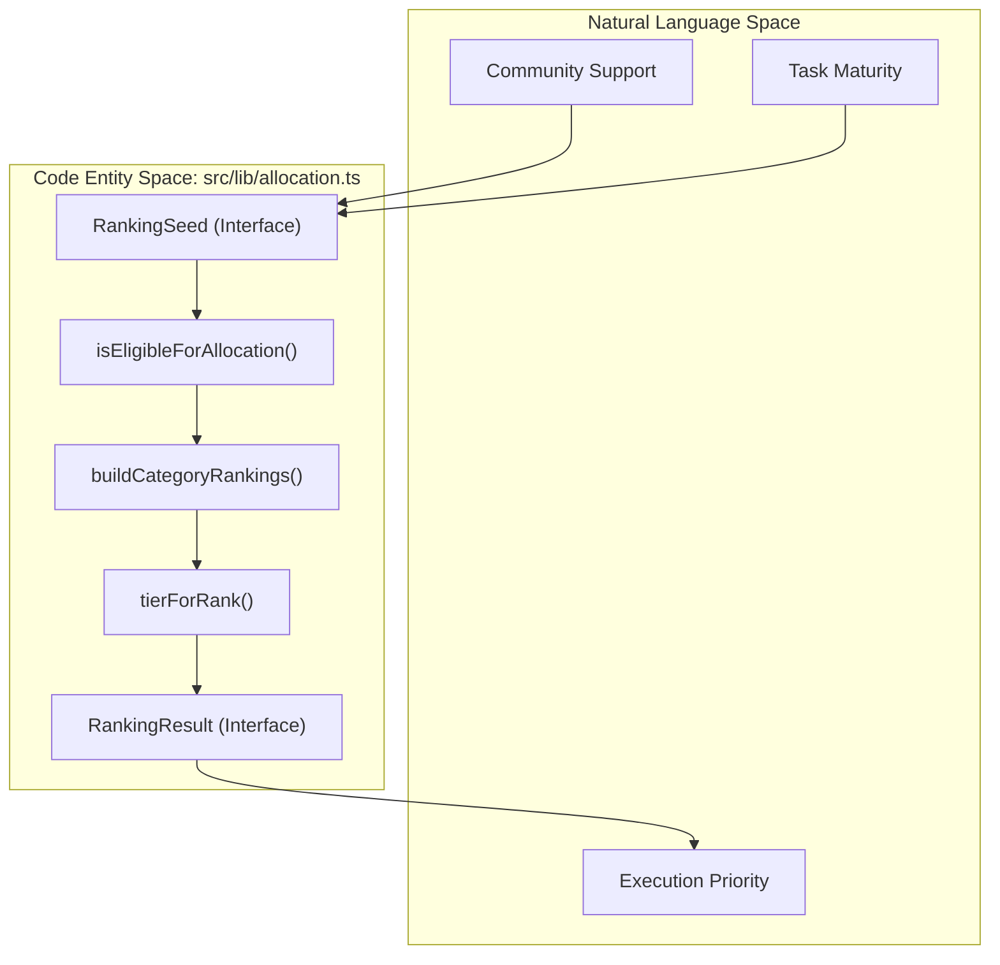
```mermaid
graph TD
    subgraph "Natural Language Space"
        UserVotes["Community Support"]
        TaskStatus["Task Maturity"]
        Priority["Execution Priority"]
    end

    subgraph "Code Entity Space: src/lib/allocation.ts"
        RankingSeed["RankingSeed (Interface)"]
        isEligible["isEligibleForAllocation()"]
        buildRankings["buildCategoryRankings()"]
        tierForRank["tierForRank()"]
        RankingResult["RankingResult (Interface)"]
    end

    UserVotes --> RankingSeed
    TaskStatus --> RankingSeed
    RankingSeed --> isEligible
    isEligible --> buildRankings
    buildRankings --> tierForRank
    tierForRank --> RankingResult
    RankingResult --> Priority
```
**Sources:** [src/lib/allocation.ts:17-21](), [src/lib/allocation.ts:57-70](), [src/lib/allocation.ts:72-73]()

### Allocation Logic Flow
This diagram illustrates the decision logic within the engine when evaluating a single task's position.

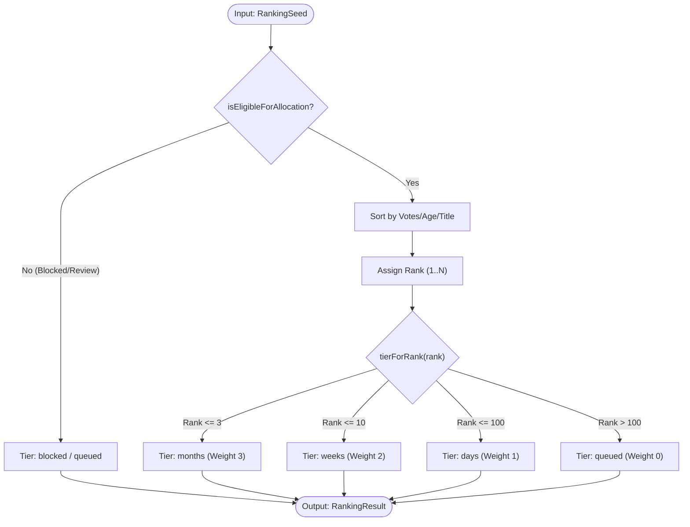
```mermaid
flowchart TD
    Start(["Input: RankingSeed"]) --> CheckEligibility{"isEligibleForAllocation?"}
    
    CheckEligibility -- "No (Blocked/Review)" --> SetBlocked["Tier: blocked / queued"]
    CheckEligibility -- "Yes" --> SortGroup["Sort by Votes/Age/Title"]
    
    SortGroup --> AssignRank["Assign Rank (1..N)"]
    AssignRank --> DetermineTier{"tierForRank(rank)"}
    
    DetermineTier -- "Rank <= 3" --> Months["Tier: months (Weight 3)"]
    DetermineTier -- "Rank <= 10" --> Weeks["Tier: weeks (Weight 2)"]
    DetermineTier -- "Rank <= 100" --> Days["Tier: days (Weight 1)"]
    DetermineTier -- "Rank > 100" --> Queued["Tier: queued (Weight 0)"]
    
    SetBlocked --> End(["Output: RankingResult"])
    Months --> End
    Weeks --> End
    Days --> End
    Queued --> End
```
**Sources:** [src/lib/allocation.ts:33-55](), [src/lib/allocation.ts:83-95](), [src/lib/allocation.ts:119-132]()

---

---

# 3.2 Attestation and Participation Policy

Relevant source files

The following files were used as context for generating this wiki page:

- [src/lib/attestation.ts](src/lib/attestation.ts)
- [tests/attestation.test.ts](tests/attestation.test.ts)

The Attestation and Participation Policy in KenMatch governs how user identity signals and Sybil risk assessments translate into functional permissions and voting power. This logic is centralized in `src/lib/attestation.ts` and ensures that while the platform remains open for reading, scarce actions like Ken submission and Voice Credit allocation are protected by identity-based gating.

## Core Logic and Policy Resolution

The system uses the `resolveParticipationPolicy()` function to determine a user's capabilities based on their current `AttestationStatus` and `SybilRiskBand`.

### Data Flow: Identity to Participation
The following diagram illustrates how raw identity signals (Status and Risk) are processed by the policy engine to produce a `ParticipationPolicy` object.

**Diagram: Policy Resolution Pipeline**
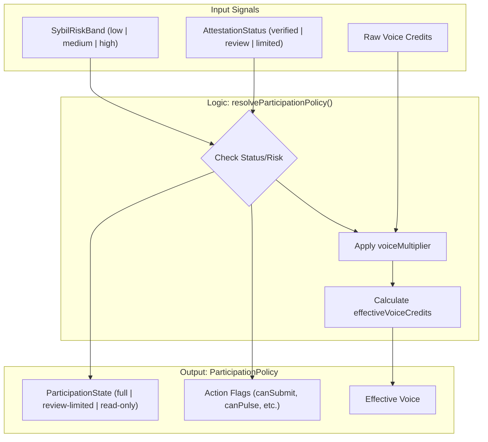
```mermaid
graph TD
    subgraph "Input Signals"
        A["AttestationStatus (verified | review | limited)"]
        B["SybilRiskBand (low | medium | high)"]
        C["Raw Voice Credits"]
    end

    subgraph "Logic: resolveParticipationPolicy()"
        D{"Check Status/Risk"}
        E["Apply voiceMultiplier"]
        F["Calculate effectiveVoiceCredits"]
    end

    subgraph "Output: ParticipationPolicy"
        G["ParticipationState (full | review-limited | read-only)"]
        H["Action Flags (canSubmit, canPulse, etc.)"]
        I["Effective Voice"]
    end

    A --> D
    B --> D
    C --> E
    D --> E
    E --> F
    F --> I
    D --> G
    D --> H
```
**Sources:** `[src/lib/attestation.ts:14-18]()`, `[src/lib/attestation.ts:3-12]()`

## Participation States

KenMatch defines three distinct participation states that determine what a user can do within the application.

| State | Description | Permissions |
| :--- | :--- | :--- |
| `full` | Strong identity signals confirmed. | All actions enabled; 100% voice capacity. |
| `review-limited` | Identity is pending or carries medium risk. | All actions enabled; Voice Credits are reduced by a multiplier. |
| `read-only` | High risk detected or account explicitly limited. | Public actions (voting, commenting, submitting) are disabled. |

**Sources:** `[src/lib/attestation.ts:19-69]()`

## Sybil Resistance and Voice Multipliers

To mitigate the impact of potential Sybil attacks (where one person creates multiple accounts to influence voting), KenMatch applies a `voiceMultiplier` to a user's base Voice Credits. This multiplier is determined by the intersection of their attestation status and risk band.

### Multiplier Matrix

The `resolveParticipationPolicy` function implements the following logic:

1.  **Read-Only Trigger**: If `AttestationStatus` is `limited` OR `SybilRiskBand` is `high`, the multiplier is `0` `[src/lib/attestation.ts:19-30]()`.
2.  **Review Logic**: If status is `review`:
    *   Low Risk: `0.7` multiplier `[src/lib/attestation.ts:33-33]()`.
    *   Medium Risk: `0.6` multiplier `[src/lib/attestation.ts:33-33]()`.
3.  **Medium Risk Verified**: If status is `verified` but risk is `medium`, a `0.8` multiplier is applied `[src/lib/attestation.ts:46-58]()`.
4.  **Full Access**: Verified users with low risk receive a `1.0` multiplier `[src/lib/attestation.ts:60-69]()`.

### Effective Voice Credit Calculation
The final voting power is calculated using `Math.floor(voiceCredits * voiceMultiplier)`, with a floor of `1` for any account that is not in a `read-only` state `[src/lib/attestation.ts:38-38]()`, `[src/lib/attestation.ts:52-52]()`.

**Sources:** `[src/lib/attestation.ts:14-70]()`

## Implementation Detail: ParticipationPolicy Interface

The `ParticipationPolicy` interface is the standard contract used by the UI and Server Actions to enforce these rules.

**Diagram: Code Entity Mapping**
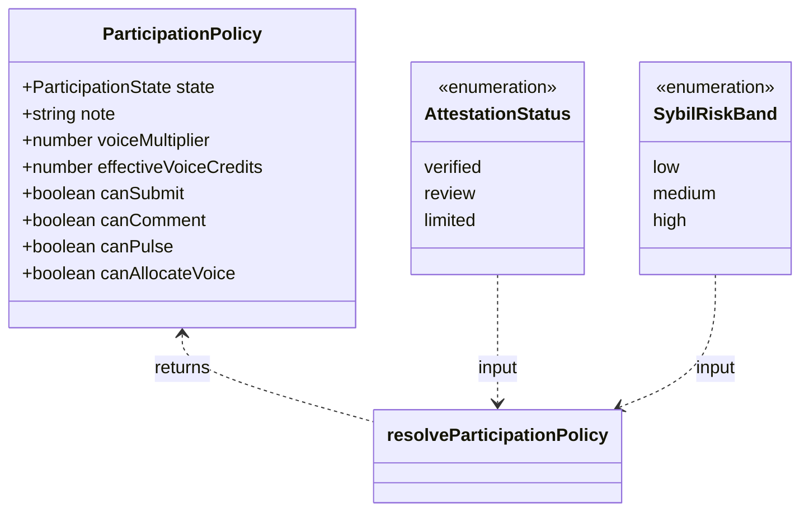
```mermaid
classDiagram
    class ParticipationPolicy {
        +ParticipationState state
        +string note
        +number voiceMultiplier
        +number effectiveVoiceCredits
        +boolean canSubmit
        +boolean canComment
        +boolean canPulse
        +boolean canAllocateVoice
    }

    class AttestationStatus {
        <<enumeration>>
        verified
        review
        limited
    }

    class SybilRiskBand {
        <<enumeration>>
        low
        medium
        high
    }

    ParticipationPolicy <.. resolveParticipationPolicy : returns
    AttestationStatus ..> resolveParticipationPolicy : input
    SybilRiskBand ..> resolveParticipationPolicy : input
```
**Sources:** `[src/lib/attestation.ts:3-12]()`, `[src/lib/attestation.ts:14-18]()`

## Testing the Policy Engine

The policy resolution logic is strictly tested to ensure that multipliers and state transitions behave as expected.

*   **Full Capacity**: Verified low-risk accounts must retain 100% of their credits `[tests/attestation.test.ts:6-13]()`.
*   **Voice Capping**: Accounts under review must have their credits reduced (e.g., 20 credits at medium risk becomes 12) `[tests/attestation.test.ts:15-22]()`.
*   **Read-Only Enforcement**: High-risk or limited accounts must have all `can...` flags set to `false` and `effectiveVoiceCredits` set to `0` `[tests/attestation.test.ts:24-32]()`.

**Sources:** `[tests/attestation.test.ts:1-33]()`

---

---

# 3.3 Economics and Treasury Logic

Relevant source files

The following files were used as context for generating this wiki page:

- [src/lib/economics.ts](src/lib/economics.ts)
- [tests/economics.test.ts](tests/economics.test.ts)

The economics engine in KenMatch responsible for calculating the financial health of the ecosystem, including revenue distribution between the treasury and founders, burn rate analysis, and runway projections. It operates as a pure-function library that transforms raw database records into high-level economic summaries.

## Revenue Stream Summarization

Revenue in KenMatch is modeled as streams with specific distribution rules. Each stream defines a percentage split between the `compute-treasury` (used to fund Kens) and `founder-ops`.

The function `summarizeRevenueStream` calculates the absolute USD values for these splits based on the `monthlyRevenueUsd` of a record.

### Revenue Calculation Logic
| Metric | Calculation |
| :--- | :--- |
| **Treasury Monthly USD** | `(monthlyRevenueUsd * treasurySharePercent) / 100` |
| **Founder Monthly USD** | `(monthlyRevenueUsd * founderSharePercent) / 100` |

**Sources:**
- `summarizeRevenueStream` definition: [src/lib/economics.ts:3-12]()
- Logic implementation: [src/lib/economics.ts:4-5]()

## Treasury Bucket Accounting

The system tracks financial movements through `TreasuryEntryRecord` objects. These entries are categorized into buckets, with `compute-treasury` being the primary bucket for public infrastructure funding.

### Balance and Restricted Funding
The `summarizeEconomics` function aggregates these entries to determine the current liquidity:
1.  **Treasury Balance**: Calculated by summing all `inflow` and subtracting all `outflow` entries specifically assigned to the `compute-treasury` bucket [src/lib/economics.ts:27-29]().
2.  **Restricted Funding Detection**: The system identifies "restricted" funds by scanning the `title` and `description` fields of treasury entries for the keyword "restricted" [src/lib/economics.ts:31-33](). This allows the system to track capital that is earmarked for specific Ken categories (e.g., civic health) rather than general compute.

**Sources:**
- `summarizeEconomics` definition: [src/lib/economics.ts:14-19]()
- Balance logic: [src/lib/economics.ts:27-29]()
- Restricted detection: [src/lib/economics.ts:31-33]()

## Economic Summary Pipeline

The `summarizeEconomics` function acts as the primary aggregator for the Economics Dashboard. It processes all revenue streams and treasury entries to produce an `EconomicsSummary`.

### Data Flow: Raw Records to EconomicsSummary
The following diagram illustrates how raw database entities are transformed into the application's economic metrics.

**Economic Summary Transformation**
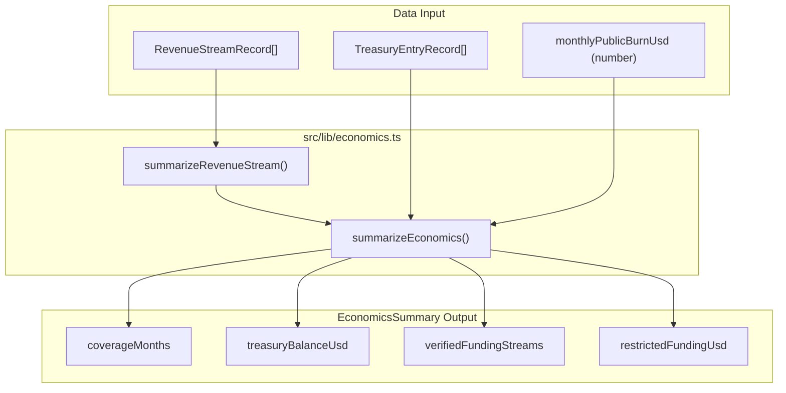
```mermaid
graph TD
    subgraph "Data Input"
        RS["RevenueStreamRecord[]"]
        TE["TreasuryEntryRecord[]"]
        PB["monthlyPublicBurnUsd (number)"]
    end

    subgraph "src/lib/economics.ts"
        SRS["summarizeRevenueStream()"]
        SUM["summarizeEconomics()"]
        
        RS --> SRS
        SRS --> SUM
        TE --> SUM
        PB --> SUM
    end

    subgraph "EconomicsSummary Output"
        CM["coverageMonths"]
        TB["treasuryBalanceUsd"]
        VF["verifiedFundingStreams"]
        RF["restrictedFundingUsd"]
    end

    SUM --> CM
    SUM --> TB
    SUM --> VF
    SUM --> RF
```
**Sources:**
- Pipeline logic: [src/lib/economics.ts:14-49]()
- Mapping function: [src/lib/economics.ts:20-20]()

## Burn Rate and Coverage Months

KenMatch calculates its "Runway" or `coverageMonths` by comparing the current treasury balance against the `monthlyPublicBurnUsd`. 

*   **Burn Rate**: The total USD spent per month to sustain the "Month" and "Week" tier Kens.
*   **Coverage Months**: Calculated as `treasuryBalanceUsd / monthlyPublicBurnUsd`, rounded to one decimal place [src/lib/economics.ts:30-30]().

If the burn rate is zero, the coverage months default to `0` to avoid division by zero errors [src/lib/economics.ts:30-30]().

**Sources:**
- Coverage calculation: [src/lib/economics.ts:30-30]()
- Unit test for coverage: [tests/economics.test.ts:118-119]()

## Revenue Engines and Status

The system distinguishes between "Committed" and "Planned" revenue to provide a realistic view of financial stability.

*   **Committed Revenue**: Any stream where the `status` is not `"planned"` (e.g., `"live"`, `"pilot"`) [src/lib/economics.ts:21-21]().
*   **Verified Funding Streams**: A count of all non-planned revenue streams [src/lib/economics.ts:34-34]().

### Revenue Engine Types
The codebase references several revenue engines used to categorize streams:
*   `enterprise`: Managed product layers [tests/economics.test.ts:11-12]().
*   `data-licensing`: Anonymized trajectory licensing [tests/economics.test.ts:45-46]().
*   `sponsorship`: Restricted pools for specific civic goals [tests/economics.test.ts:58-59]().

**Sources:**
- Status filtering: [src/lib/economics.ts:21-25]()
- Verified stream count: [src/lib/economics.ts:34-34]()
- Engine examples: [tests/economics.test.ts:6-67]()

## Summary of Logic Entities

The following diagram maps the natural language economic concepts to the specific TypeScript interfaces and functions defined in `src/lib/economics.ts`.

**Domain to Code Entity Mapping**
```mermaid
classDiagram
    class TreasuryAccounting {
        +summarizeEconomics()
        +summarizeRevenueStream()
    }

    class RevenueStreamRecord {
        +monthlyRevenueUsd: number
        +treasurySharePercent: number
        +status: live|pilot|planned
    }

    class TreasuryEntryRecord {
        +bucket: compute_treasury|founder_ops
        +direction: inflow|outflow
        +amountUsd: number
    }

    class EconomicsSummary {
        +treasuryBalanceUsd: number
        +coverageMonths: number
        +restrictedFundingUsd: number
        +verifiedFundingStreams: number
    }

    TreasuryAccounting ..> RevenueStreamRecord : processes
    TreasuryAccounting ..> TreasuryEntryRecord : processes
    TreasuryAccounting ..> EconomicsSummary : produces
```

**Sources:**
- Type imports: [src/lib/economics.ts:1-1]()
- Summary interface usage: [src/lib/economics.ts:19-19]()
- Record processing: [src/lib/economics.ts:20-34]()

---

---

# 3.4 Session Management and Environment Configuration

Relevant source files

The following files were used as context for generating this wiki page:

- [src/lib/env.ts](src/lib/env.ts)
- [src/lib/session.ts](src/lib/session.ts)

This section details the mechanisms for managing user sessions and the robust environment configuration system used across the KenMatch platform. These systems ensure secure state management via cookies and type-safe access to application settings.

## Environment Configuration

KenMatch utilizes a centralized, Zod-validated environment configuration system defined in `src/lib/env.ts`. This ensures that the application fails fast during startup if required variables are missing or malformed.

### Validation Schema
The system uses a `booleanish` preprocessor to handle various ways environment variables might represent truthy/falsy values (e.g., "true", "1", "false", "0") [src/lib/env.ts:3-23](). The `envSchema` defines the expected structure and default values for the application [src/lib/env.ts:25-34]().

### Configuration Variables
| Variable | Description | Default |
| :--- | :--- | :--- |
| `NODE_ENV` | Deployment environment (`development`, `test`, `production`) | `development` |
| `DATABASE_URL` | Connection string for remote libSQL/Turso databases | `undefined` |
| `DATABASE_AUTH_TOKEN` | Authentication token for remote database access | `undefined` |
| `KENMATCH_DB_FILE` | Local path for the SQLite database file | `data/kenmatch.sqlite` |
| `KENMATCH_SESSION_COOKIE` | Name of the HTTP-only session cookie | `kenmatch-session` |
| `KENMATCH_SESSION_DAYS` | Duration of session validity in days | `14` |
| `KENMATCH_ALLOW_SIGNUPS` | Toggle to enable or disable new user registrations | `true` |
| `KENMATCH_ENABLE_DEMO_PROFILE_SWITCHER` | Enables the UI for rapid profile switching in dev/demo | `false` |

### Database Connectivity Modes
The application determines its persistence strategy based on the presence of `DATABASE_URL`. If provided, it connects to a remote libSQL instance; otherwise, it defaults to a local file-based SQLite database specified by `KENMATCH_DB_FILE` [src/lib/env.ts:27-29]().

**Sources:**
- [src/lib/env.ts:3-36]()

---

## Session Management

Session management is handled via secure, server-side cookies. The logic is encapsulated in `src/lib/session.ts`, which interacts with Next.js `headers` and the database layer to authenticate requests.

### Cookie Lifecycle
The `cookieOptions` function defines the security profile for the session cookie [src/lib/session.ts:8-16](). 
- **httpOnly**: Always `true` to prevent XSS-based token theft.
- **sameSite**: Set to `lax` for CSRF protection while allowing top-level navigations.
- **secure**: Set to `true` only when `NODE_ENV` is `production`.
- **maxAge**: Calculated based on `KENMATCH_SESSION_DAYS` [src/lib/session.ts:31]().

### Key Functions
- `getViewerSession()`: Retrieves the current session by reading the cookie and looking up the corresponding token in the database via `getViewerSessionByToken` [src/lib/session.ts:18-22]().
- `getViewerProfileId()`: A helper that extracts only the `profile.id` from the current session [src/lib/session.ts:24-27]().
- `setViewerSessionCookie(token)`: Persists a session token to the browser with the configured expiration [src/lib/session.ts:29-32]().
- `clearViewerSessionCookie()`: Effectively logs out the user by setting the cookie expiration to `0` [src/lib/session.ts:34-37]().

### Session Data Flow
The following diagram illustrates how a user request is authenticated against the database using the session utilities.

**Request Authentication Flow**
```mermaid
sequenceDiagram
    participant B as "Browser"
    participant S as "src/lib/session.ts"
    participant D as "src/lib/db.ts"
    
    B->>S: "Request with ACTIVE_SESSION_COOKIE"
    S->>S: "getViewerSession()"
    S->>D: "getViewerSessionByToken(token)"
    D-->>S: "Session + Profile Data"
    S-->>B: "Authenticated Context"
```

**Sources:**
- [src/lib/session.ts:1-42]()
- [src/lib/env.ts:30-31]()

---

## Integration: Environment to Session

The session management logic is tightly coupled with the environment configuration to ensure consistency across different deployment stages.

**Environment and Session Association**
```mermaid
graph TD
    subgraph "Environment Space (src/lib/env.ts)"
        E["envSchema"]
        KSC["KENMATCH_SESSION_COOKIE"]
        KSD["KENMATCH_SESSION_DAYS"]
        NE["NODE_ENV"]
    end

    subgraph "Session Space (src/lib/session.ts)"
        ASC["ACTIVE_SESSION_COOKIE"]
        CO["cookieOptions()"]
        SVS["setViewerSessionCookie()"]
        GVS["getViewerSession()"]
    end

    KSC --> ASC
    KSD --> SVS
    NE --> CO
    ASC --> GVS
    ASC --> SVS
```

### Technical Implementation Details
1. **Cookie Name**: The constant `ACTIVE_SESSION_COOKIE` is directly assigned from `env.KENMATCH_SESSION_COOKIE` [src/lib/session.ts:6]().
2. **Security**: The `secure` flag in `cookieOptions` is dynamically set based on `env.NODE_ENV === "production"` [src/lib/session.ts:12]().
3. **Session Expiry**: When `setViewerSessionCookie` is called, it converts `env.KENMATCH_SESSION_DAYS` into seconds for the `maxAge` attribute [src/lib/session.ts:31]().

**Sources:**
- [src/lib/session.ts:6-32]()
- [src/lib/env.ts:25-34]()

---

---

# 4 Application Routes and Server Actions

Relevant source files

The following files were used as context for generating this wiki page:

- [src/app/action-state.ts](src/app/action-state.ts)
- [src/app/actions.ts](src/app/actions.ts)
- [src/app/api/health/route.ts](src/app/api/health/route.ts)
- [src/app/layout.tsx](src/app/layout.tsx)

This section provides an overview of the KenMatch application structure, built on the Next.js App Router. It describes the relationship between the file-based routing system, the data fetching patterns from the persistence layer, and the server-side mutation logic that handles user interactions.

## Page Structure and Data Flow

KenMatch utilizes a hybrid rendering approach where pages are Server Components by default. These components fetch data directly from the `db.ts` module, which manages the libSQL connection and in-memory hydration.

The application is organized into several key route groups:
*   **Discovery**: The homepage and board views for browsing Kens.
*   **Governance & Economics**: Transparency dashboards for treasury management and system rules.
*   **Contribution**: Forms for submitting new Ken proposals and managing authentication.

### Data Hydration Pattern
When a request hits a route, the following flow occurs:
1.  **Layout Fetching**: The `RootLayout` concurrently fetches the global profile list and the current viewer session [src/app/layout.tsx:27-27]().
2.  **Page Fetching**: Individual pages call specialized getters (e.g., `getHealthSummary()`) to retrieve specific slices of the system state [src/app/api/health/route.ts:6-6]().
3.  **UI Projection**: The fetched data is passed into Client Components for interactivity (like voting or filtering) while maintaining server-side rendering for SEO and initial load performance.

### System Routing Map
The following diagram illustrates the relationship between URL paths and their primary data sources.

**KenMatch Route to Data Mapping**
```mermaid
graph TD
    subgraph "URL Space"
        R["/"] --> P["page.tsx"]
        R --> K["/kens"]
        R --> T["/tasks"]
        R --> G["/governance"]
        R --> E["/economics"]
        R --> S["/submit"]
        R --> A["/auth"]
    end

    subgraph "Data Entity Space"
        P --> DB1["getHealthSummary()"]
        K --> DB2["listTasks()"]
        T --> DB2
        G --> DB3["listRuns()"]
        E --> DB4["getTreasurySummary()"]
        A --> DB5["authenticateAccount()"]
    end

    subgraph "Persistence"
        DB1 & DB2 & DB3 & DB4 & DB5 --> SQL["libSQL / SQLite"]
    end
```
Sources: [src/app/layout.tsx:27-27](), [src/app/api/health/route.ts:6-6](), [src/app/actions.ts:126-126]()

## Server Actions and Mutations

Mutations in KenMatch are handled via **Next.js Server Actions** defined in `src/app/actions.ts`. This layer bridges the frontend forms to the database while enforcing validation and session requirements.

### Action State Pattern
All actions follow a standardized `ActionState` interface to communicate results back to the UI:
*   **Status**: `idle`, `error`, or `success` [src/app/action-state.ts:2-2]().
*   **Validation**: Uses **Zod** schemas (e.g., `proposalSchema`, `voteSchema`) to validate `FormData` before hitting the database [src/app/actions.ts:29-82]().
*   **Feedback**: Returns `fieldErrors` for specific UI highlighting [src/app/action-state.ts:4-4]().

### Mutation Lifecycle
The diagram below shows how a user action (like submitting a Ken) moves through the system.

**Server Action Execution Flow**
```mermaid
sequenceDiagram
    participant UI as "Client Form"
    participant SA as "actions.ts (Server Action)"
    participant DB as "db.ts (Database)"
    participant NC as "Next.js Cache"

    UI->>SA: submit FormData
    SA->>SA: validate with Zod Schema
    SA->>SA: requireViewerProfileId()
    SA->>DB: createProposal() / saveVote()
    DB-->>SA: Result / ID
    SA->>NC: revalidateCorePaths()
    SA->>UI: redirect() or return ActionState
```
Sources: [src/app/actions.ts:95-101](), [src/app/actions.ts:103-114](), [src/app/actions.ts:182-212]()

## Sub-Topic Overviews

### [Home, Ken Board, and Ken Detail Pages](#4.1)
Covers the primary discovery interfaces. The homepage provides high-level metrics via `getHealthSummary`, while the board routes (`/kens` and `/tasks`) provide filtered views of the Ken lifecycle. Detail pages (`/kens/[slug]`) aggregate timing strips, audit trails, and the `saveVoteAction` for quadratic allocation.
*For details, see [Home, Ken Board, and Ken Detail Pages](#4.1).*

### [Governance, Economics, and Submit Pages](#4.2)
Focuses on the operational transparency of the platform. This includes the attestation ladder for sybil resistance, the treasury dashboard for tracking revenue streams and burn rates, and the multi-step `createProposalAction` used in the submission intake form.
*For details, see [Governance, Economics, and Submit Pages](#4.2).*

### [Authentication Routes and Server Actions](#4.3)
Describes the session management flow. It covers the `signInAction` and `signUpAction`, the `KENMATCH_ALLOW_SIGNUPS` environment gate, and how the `SiteShell` utilizes `getViewerSession` to manage the global profile switcher.
*For details, see [Authentication Routes and Server Actions](#4.3).*

---
**Sources:**
*   [src/app/actions.ts:1-212]()
*   [src/app/layout.tsx:1-39]()
*   [src/app/action-state.ts:1-11]()
*   [src/app/api/health/route.ts:1-9]()

---

---

# 4.1 Home, Ken Board, and Ken Detail Pages

Relevant source files

The following files were used as context for generating this wiki page:

- [src/app/kens/[slug]/page.tsx](src/app/kens/[slug]/page.tsx)
- [src/app/kens/page.tsx](src/app/kens/page.tsx)
- [src/app/page.tsx](src/app/page.tsx)
- [src/app/tasks/[slug]/page.tsx](src/app/tasks/[slug]/page.tsx)
- [src/app/tasks/page.tsx](src/app/tasks/page.tsx)

This page details the implementation of the primary user-facing routes in KenMatch. These routes handle the display of global metrics, the filtered exploration of Kens (tasks), and the deep-dive detail views that facilitate quadratic voting and audit trail inspection.

## 1. Homepage Metrics and Featured Content

The homepage `src/app/page.tsx` serves as the entry point, providing a high-level overview of the system's health, active allocation lanes, and featured Kens.

### Implementation and Data Flow
The page is a Server Component that retrieves a comprehensive data snapshot via `getHomeData(viewerProfileId)` [src/app/page.tsx:10](). This function aggregates:
- **Global Metrics**: Counts for total proposals, active runs, bonded voice credits, and monthly treasury commitments [src/app/page.tsx:50-53]().
- **Allocation Lanes**: Static definitions for "Months", "Weeks", and "Days" tiers which describe the scope of Kens in each bucket [src/app/page.tsx:41-47]().
- **Featured Kens**: A subset of tasks currently leading the board [src/app/page.tsx:66]().
- **Economic Snapshot**: Real-time treasury coverage months, sponsor pool totals, and verified funding streams [src/app/page.tsx:91-95]().

### Visual Components
- **Hero Section**: Displays the primary mission and call-to-action links (`/kens`, `/submit`, `/economics`) [src/app/page.tsx:14-27]().
- **Category Grid**: Lists available Ken categories and their respective proposal counts [src/app/page.tsx:74-82]().
- **Governance & Contributors**: Shows recent decision logs from various "Houses" and a sample of active community contributors [src/app/page.tsx:112-124]().

**Sources:** [src/app/page.tsx:1-124](), [src/lib/db.ts:4]().

---

## 2. Ken Board (Marketplace)

The Ken Board (`src/app/kens/page.tsx`) provides a filtered interface for browsing the full library of tasks. It supports searching, category filtering, and status-based navigation.

### Routing and Redirection
To maintain URL consistency, the legacy `/tasks` route is redirected to `/kens` [src/app/tasks/page.tsx:4-5](). Similarly, individual task slugs are redirected to the Ken detail path [src/app/tasks/[slug]/page.tsx:5]().

### Filtering Logic
The `KensPage` component parses `searchParams` to determine the current view state:
- **Query (`q`)**: Text search against titles and summaries [src/app/kens/page.tsx:18]().
- **Category**: Filters by specific domain (e.g., "AI Safety", "Public Tools") [src/app/kens/page.tsx:19]().
- **Tier**: Filters by allocation lane (`months`, `weeks`, `days`) [src/app/kens/page.tsx:20]().
- **Stage**: Filters by lifecycle state (`proposed`, `active`, `shipped`, `blocked`) [src/app/kens/page.tsx:21]().

Data is fetched via `getMarketplaceData(viewerProfileId, filters)` [src/app/kens/page.tsx:22]().

### Natural Language to Code Entity Map: Discovery
The following diagram maps user-facing "Board" concepts to the underlying code entities.

**Diagram: Discovery Logic Mapping**
```mermaid
graph TD
  subgraph "User Interface Space"
    SearchInput["'Search' Input"]
    TierDropdown["'Allocation Lane' Filter"]
    StageTabs["'Stage' Tabs (Active/Blocked)"]
    KenGrid["Ken Grid"]
  end

  subgraph "Code Entity Space (src/app/kens/page.tsx)"
    KensPage["KensPage Component"]
    SearchParams["searchParams Object"]
    MarketplaceFilters["MarketplaceFilters Type"]
    GetMarketplaceData["getMarketplaceData() (lib/db.ts)"]
  end

  SearchInput -->|"q=..."| SearchParams
  TierDropdown -->|"tier=..."| SearchParams
  StageTabs -->|"stage=..."| SearchParams
  SearchParams --> KensPage
  KensPage -->|"Apply Validations"| MarketplaceFilters
  MarketplaceFilters --> GetMarketplaceData
  GetMarketplaceData -->|"Returns Task[]"| KenGrid
```
**Sources:** [src/app/kens/page.tsx:1-51](), [src/lib/types.ts:5-6]().

---

## 3. Ken Detail Page

The detail page (`src/app/kens/[slug]/page.tsx`) is the most data-intensive route, combining descriptive content, economic data, run plans, and interactive voting panels.

### Data Aggregation
The page calls `getTaskDetail(slug, viewerProfileId)` [src/app/kens/[slug]/page.tsx:16](). If the slug does not exist, it triggers a `notFound()` [src/app/kens/[slug]/page.tsx:18]().

### Key Sections
| Section | Description | Code Reference |
| :--- | :--- | :--- |
| **Hero & Meta** | Displays tier chip, stage, category, and public score. | [src/app/kens/[slug]/page.tsx:23-39]() |
| **Timing Strip** | Visualizes the Ken's lifecycle timeline. | [src/app/kens/[slug]/page.tsx:40]() |
| **Metrics** | Total voice credits, supporter count, and category rank. | [src/app/kens/[slug]/page.tsx:41-45]() |
| **Content Blocks** | Problem statement, public benefit, and deliverables. | [src/app/kens/[slug]/page.tsx:50-63]() |
| **Run Plan** | Backend details, runtime caps, and checkpoint gates. | [src/app/kens/[slug]/page.tsx:77-102]() |
| **Audit Trail** | Incremental updates and historical activity logs. | [src/app/kens/[slug]/page.tsx:113-120]() |

### Interactive Panels
- **VotePanel**: Handles Quadratic Voting (QV) for authenticated users. It displays the viewer's available voice credits and current allocation to the Ken [src/app/kens/[slug]/page.tsx:135]().
- **TaskPulsePanel**: Displays the "Public Pulse" score, a separate signal from scarce voice credits [src/app/kens/[slug]/page.tsx:134]().
- **DiscussionThread**: Provides a threaded comment interface for community review [src/app/kens/[slug]/page.tsx:136]().

### Natural Language to Code Entity Map: Ken Lifecycle
The following diagram bridges the conceptual "Ken Lifecycle" to the database entities and components that render them.

**Diagram: Ken Lifecycle Entity Map**
```mermaid
graph LR
  subgraph "Lifecycle State"
    Proposal["Proposal"]
    Allocation["Allocation"]
    Execution["Execution"]
    Audit["Audit"]
  end

  subgraph "Code Entity Space"
    TaskDB["tasks Table (lib/db.ts)"]
    VotePanelComp["VotePanel (components/vote-panel.tsx)"]
    RunDB["runs Table (lib/db.ts)"]
    CheckpointDB["checkpoints Table (lib/db.ts)"]
    RunUpdates["run_updates Table (lib/db.ts)"]
  end

  Proposal --> TaskDB
  Allocation --> VotePanelComp
  Execution --> RunDB
  Execution --> CheckpointDB
  Audit --> RunUpdates
```
**Sources:** [src/app/kens/[slug]/page.tsx:1-140](), [src/lib/db.ts:7](), [src/components/vote-panel.tsx:6]().

---

## 4. Participation and Session Logic

The behavior of these pages changes based on the `viewerProfile` status, which is retrieved via `getViewerSession()` [src/app/kens/[slug]/page.tsx:13]().

- **Anonymous Access**: Users can read all Kens, view metrics, and browse the board. They are prompted with a `publicParticipationMessage` suggesting they sign in to vote or comment [src/app/kens/[slug]/page.tsx:15]().
- **Authenticated Access**: Users see their specific `availableCredits` [src/app/page.tsx:31]() and can interact with the `VotePanel` and `DiscussionThread`.
- **Policy Enforcement**: The `participationNote` from the profile (resolved via attestation logic) informs the user of any restrictions (e.g., read-only mode due to high Sybil risk) [src/app/kens/[slug]/page.tsx:15]().

**Sources:** [src/app/kens/[slug]/page.tsx:13-16](), [src/app/page.tsx:29-35](), [src/lib/session.ts:8]().

---

---

# 4.2 Governance, Economics, and Submit Pages

Relevant source files

The following files were used as context for generating this wiki page:

- [src/app/economics/page.tsx](src/app/economics/page.tsx)
- [src/app/governance/page.tsx](src/app/governance/page.tsx)
- [src/app/submit/page.tsx](src/app/submit/page.tsx)

This section covers the administrative and intake layers of KenMatch. These pages provide transparency into the decision-making process, the financial health of the treasury, and the mechanism for proposing new Kens.

## Governance Page

The Governance page ([src/app/governance/page.tsx]()) serves as the transparency layer for the platform. It visualizes the "Attestation Ladder," the "Recent Governance Log," and "Blocked Kens." The primary goal is to maintain a legible public process for resource allocation and safety boundaries.

### Implementation Details
The page is a React Server Component that fetches data via `getGovernanceData` [src/app/governance/page.tsx:7-7]().

*   **Attestation Ladder**: Displays the top profiles, showing their `attestationLevel`, `sybilRisk`, and `effectiveVoiceCredits` [src/app/governance/page.tsx:30-52](). This reflects how much "Voice" (voting power) an account holds based on its verified standing.
*   **Governance Log**: A chronological list of decisions made by different "Houses" (e.g., community, founders). It displays the `decision` and the `outcome` [src/app/governance/page.tsx:56-69]().
*   **Blocked Kens**: Specifically filters and displays tasks where the `allocatedTier` is set to a blocked state [src/app/governance/page.tsx:71-81](). These are rendered with a distinct red visual style to indicate they have been rejected or halted for safety/policy reasons.
*   **Category Health**: Summarizes the status of different categories, showing counts for `eligible`, `running`, and `shipped` Kens [src/app/governance/page.tsx:84-95]().

### Data Flow: Governance
The following diagram maps the UI sections to the underlying data entities retrieved from the database.

"Governance UI to Data Mapping"
```mermaid
graph TD
    subgraph "Code Entity Space (lib/db.ts)"
        DB_GOV["getGovernanceData()"]
        TABLE_GOV["governance_log"]
        TABLE_PROF["profiles"]
        TABLE_TASK["tasks"]
        TABLE_CAT["categories"]
    end

    subgraph "Natural Language / UI Space"
        UI_LADDER["Attestation Ladder"]
        UI_LOG["Governance Log"]
        UI_BLOCKED["Blocked Kens"]
        UI_HEALTH["Category Health"]
    end

    DB_GOV --> TABLE_GOV
    DB_GOV --> TABLE_PROF
    DB_GOV --> TABLE_TASK
    DB_GOV --> TABLE_CAT

    TABLE_PROF --> UI_LADDER
    TABLE_GOV --> UI_LOG
    TABLE_TASK -- "allocatedTier = 'blocked'" --> UI_BLOCKED
    TABLE_CAT --> UI_HEALTH
```
Sources: [src/app/governance/page.tsx:1-98](), [src/lib/db.ts:1-1]()

---

## Economics Page

The Economics page ([src/app/economics/page.tsx]()) provides a dashboard for the KenMatch treasury. It distinguishes between revenue that supports operations and revenue that is restricted to specific Kens (Sponsor Pools).

### Key Metrics and Logic
The page consumes data from `getEconomicsData` [src/app/economics/page.tsx:7-7](), which calculates:
*   **Coverage Months**: How long the current treasury can sustain the current burn rate [src/app/economics/page.tsx:25-25]().
*   **Revenue Streams**: Individual sources of income, split between `treasuryMonthlyUsd` (shared compute) and `founderMonthlyUsd` (operations) [src/app/economics/page.tsx:35-48]().
*   **Treasury Ledger**: A granular list of `treasury_entries` showing the `direction` (inflow/outflow) and `amountUsd` [src/app/economics/page.tsx:51-65]().
*   **Funded Kens**: Tasks that have successfully attracted a "Sponsor Pool," which is restricted funding for that specific deliverable [src/app/economics/page.tsx:81-94]().

### Economics System Architecture
This diagram illustrates how revenue flows through the system into different buckets.

"Revenue and Treasury Flow"
```mermaid
graph LR
    subgraph "Inflow Sources"
        REV_STREAM["revenue_streams"]
        SPONSOR["Sponsor Pools"]
    end

    subgraph "Allocation Logic (lib/economics.ts)"
        CALC["summarizeEconomics()"]
    end

    subgraph "Buckets"
        TREASURY["Treasury Balance"]
        FOUNDER["Founder Ops"]
        RESTRICTED["Restricted Funding"]
    end

    REV_STREAM --> CALC
    SPONSOR --> CALC
    CALC --> TREASURY
    CALC --> FOUNDER
    CALC --> RESTRICTED
    
    TREASURY --> COVERAGE["Coverage Months Calculation"]
```
Sources: [src/app/economics/page.tsx:1-98](), [src/lib/economics.ts:1-1]()

---

## Submit Page

The Submit page ([src/app/submit/page.tsx]()) is the entry point for new Ken proposals. It enforces an "accountable intake" policy where anonymous submissions are prohibited.

### Intake Process
1.  **Session Check**: The page calls `getViewerSession()` [src/app/submit/page.tsx:8-8]().
2.  **Auth Guard**: If no viewer is present, it renders a "Sign in required" message [src/app/submit/page.tsx:23-27]().
3.  **Proposal Form**: If authenticated, it renders the `ProposalForm` component, passing the available `categories` for selection [src/app/submit/page.tsx:21-21]().

### Proposal Form Components
The `ProposalForm` (defined in `src/components/proposal-form.tsx`) handles the complex state of a Ken submission, including:
*   **Deliverables and Risks**: Clear definitions of what will be built and what could go wrong.
*   **Enterprise Packaging**: How the Ken can be supported by commercial entities.
*   **Tier Selection**: Initial request for ranking (e.g., Months, Weeks, Days).

"Submit Flow and State"
```mermaid
sequenceDiagram
    participant User
    participant Page as src/app/submit/page.tsx
    participant Form as src/components/proposal-form.tsx
    participant Action as src/app/actions.ts

    User->>Page: Access /submit
    Page->>Page: getViewerSession()
    alt Not Authenticated
        Page-->>User: Show Auth Guard
    else Authenticated
        Page->>Form: Render ProposalForm(categories)
        User->>Form: Fill Details (Title, Problem, Deliverables)
        Form->>Action: submitProposalAction(formData)
        Action->>Action: validate with Zod
        Action-->>User: Redirect to New Ken Detail Page
    end
```
Sources: [src/app/submit/page.tsx:1-31](), [src/components/proposal-form.tsx:1-1]()

## Summary of Key Entities

| Page | Primary Data Function | Key UI Component | Core Logic |
| :--- | :--- | :--- | :--- |
| **Governance** | `getGovernanceData` | `Attestation Ladder` | Filters for `blocked` status and `attestationLevel`. |
| **Economics** | `getEconomicsData` | `MetricGrid` | Calculates `coverageMonths` and splits revenue streams. |
| **Submit** | `getHomeData` | `ProposalForm` | Enforces `viewer` session for accountability. |

Sources: [src/app/governance/page.tsx:7-7](), [src/app/economics/page.tsx:7-7](), [src/app/submit/page.tsx:8-9]()

---

---

# 4.3 Authentication Routes and Server Actions

Relevant source files

The following files were used as context for generating this wiki page:

- [src/app/action-state.ts](src/app/action-state.ts)
- [src/app/actions.ts](src/app/actions.ts)
- [src/app/api/health/route.ts](src/app/api/health/route.ts)
- [src/app/auth/page.tsx](src/app/auth/page.tsx)

This page details the implementation of the authentication system in KenMatch, focusing on the sign-in/sign-up user interface, the server actions that manage session state, and the security gates enforced by environment configuration.

## Authentication Overview

KenMatch uses a custom session-based authentication system backed by libSQL. It separates "open reading" from "accountable participation" (voting, commenting, and submission) by requiring a verified contributor profile for the latter [src/app/auth/page.tsx:17-19]().

### Authentication Flow
The following diagram illustrates the transition from the `AuthPage` UI through Server Actions to the persistence layer.

**Authentication Entity Mapping**
```mermaid
graph TD
    subgraph "Natural Language Space"
        UI["Sign-in / Sign-up Form"]
        Session["User Session"]
        Gate["Signup Gate"]
    end

    subgraph "Code Entity Space"
        AuthPage["src/app/auth/page.tsx"]
        AuthPanels["src/components/auth-panels.tsx"]
        SignInAction["signInAction (actions.ts)"]
        SignUpAction["signUpAction (actions.ts)"]
        EnvGate["KENMATCH_ALLOW_SIGNUPS (env.ts)"]
        DB_Auth["authenticateAccount (db.ts)"]
        DB_Create["createAccount (db.ts)"]
    end

    AuthPage --> AuthPanels
    AuthPanels -- "Submits Form" --> SignInAction
    AuthPanels -- "Submits Form" --> SignUpAction
    SignUpAction -- "Checks" --> EnvGate
    SignInAction -- "Calls" --> DB_Auth
    SignUpAction -- "Calls" --> DB_Create
```
Sources: [src/app/auth/page.tsx:3-21](), [src/app/actions.ts:116-170]()

## Authentication Route (`/auth`)

The authentication route is handled by `src/app/auth/page.tsx`. It serves as the entry point for users to join the "public ledger" [src/app/auth/page.tsx:16]().

- **Session Check**: The page first calls `getViewerSession()` [src/app/auth/page.tsx:7](). If a session already exists, the user is redirected to the home page [src/app/auth/page.tsx:9]().
- **UI Rendering**: It renders the `AuthPanels` component, which contains the actual forms for signing in and signing up [src/app/auth/page.tsx:21]().

Sources: [src/app/auth/page.tsx:1-24]()

## Server Actions and Mutation Logic

Authentication mutations are handled via Next.js Server Actions defined in `src/app/actions.ts`. These actions follow a standardized `ActionState` pattern for error reporting.

### ActionState Pattern
Every action returns an `ActionState` object [src/app/action-state.ts:1-5](), which allows the UI to display granular feedback:
| Property | Type | Description |
| :--- | :--- | :--- |
| `status` | `"idle" \| "error" \| "success"` | The current state of the operation. |
| `message` | `string` | A human-readable summary of the result. |
| `fieldErrors` | `Record<string, string>` | Map of field names to specific Zod validation errors. |

Sources: [src/app/action-state.ts:1-11](), [src/app/actions.ts:118-123]()

### Key Server Actions

#### `signInAction`
Authenticates an existing user and establishes a session.
1. **Validation**: Uses `signInSchema` to validate email and password [src/app/actions.ts:117]().
2. **Authentication**: Calls `authenticateAccount()` to verify credentials against the database [src/app/actions.ts:126]().
3. **Session Creation**: If successful, calls `createSession()` and `setViewerSessionCookie()` [src/app/actions.ts:134-135]().
4. **Redirection**: Triggers `revalidateCorePaths()` and redirects to `/` [src/app/actions.ts:136-137]().

#### `signUpAction`
Creates a new contributor profile and account.
1. **Signup Gate**: Checks `env.KENMATCH_ALLOW_SIGNUPS`. If `false`, it returns an error immediately [src/app/actions.ts:141-146]().
2. **Validation**: Uses `signUpSchema` which extends the sign-in schema with profile fields like `name`, `role`, and `bio` [src/app/actions.ts:77-82]().
3. **Account Creation**: Calls `createAccount()` [src/app/actions.ts:158]().
4. **Auto-Login**: Immediately creates a session for the new account [src/app/actions.ts:159-160]().

#### `signOutAction`
Terminates the current session.
1. **Token Retrieval**: Gets the current token via `getViewerToken()` [src/app/actions.ts:173]().
2. **Revocation**: Deletes the session from the database using `deleteSessionByToken()` [src/app/actions.ts:175]().
3. **Cookie Cleanup**: Calls `clearViewerSessionCookie()` [src/app/actions.ts:177]().

Sources: [src/app/actions.ts:116-180]()

## Implementation Details

### Data Flow: Sign-In Process
The following sequence diagram details the interaction between the client, server actions, and the database during a sign-in attempt.

**Sign-In Sequence**
```mermaid
sequenceDiagram
    participant Client as "Browser (AuthPanels)"
    participant Action as "signInAction (actions.ts)"
    participant DB as "libSQL (db.ts)"
    participant Session as "Cookie (session.ts)"

    Client->>Action: Submit FormData
    Action->>Action: Validate with signInSchema
    Action->>DB: authenticateAccount(email, pass)
    DB-->>Action: Account Object
    Action->>DB: createSession(accountId)
    DB-->>Action: Session (token)
    Action->>Session: setViewerSessionCookie(token)
    Action->>Client: Redirect("/")
```
Sources: [src/app/actions.ts:116-138](), [src/lib/session.ts:26]()

### Global Revalidation
After any authentication state change (sign-in, sign-up, or sign-out), the system calls `revalidateCorePaths()` [src/app/actions.ts:136, 168, 178](). This helper ensures that cached pages reflecting user-specific data (like the "Submit" page or "Governance" dashboard) are updated immediately [src/app/actions.ts:103-114]().

### Security Gating
KenMatch uses the `requireViewerProfileId()` helper within other server actions (like `createProposalAction`) to enforce authentication [src/app/actions.ts:95-101](). If no session is found, it throws an error that is caught by the `ActionState` handler [src/app/actions.ts:201, 208-211]().

Sources: [src/app/actions.ts:95-114](), [src/app/actions.ts:182-212]()

---

---

# 5 UI Components

Relevant source files

The following files were used as context for generating this wiki page:

- [src/app/globals.css](src/app/globals.css)
- [src/app/layout.tsx](src/app/layout.tsx)
- [src/components/site-shell.tsx](src/components/site-shell.tsx)

The KenMatch UI is built using **React** and **Tailwind CSS**, following a "brutalist-elegant" aesthetic defined by high-contrast typography and ambient gradients. The component library in `src/components/` is designed to handle the complex data visualizations required for Quadratic Voting, treasury management, and multi-stage Ken lifecycles.

### Component Architecture Overview

The UI is structured into three primary layers: the **Site Shell** (providing the global frame and theme), **Domain Components** (specialized for Ken boards and voting), and **Form/Auth Components** (handling user input and session state).

The following diagram maps the high-level UI concepts to their implementing code entities:

**UI to Code Mapping**
```mermaid
graph TD
    subgraph "Natural Language Space"
        A["Global Site Layout"]
        B["Ken Board / Task List"]
        C["Quadratic Voting UI"]
        D["Ken Proposal Form"]
        E["Visual Identity"]
    end

    subgraph "Code Entity Space"
        A1["SiteShell (site-shell.tsx)"]
        B1["TaskCard (task-card.tsx)"]
        C1["VotePanel (vote-panel.tsx)"]
        D1["ProposalForm (proposal-form.tsx)"]
        E1["globals.css (Themes & Variables)"]
    end

    A --> A1
    B --> B1
    C --> C1
    D --> D1
    E --> E1

    A1 -.-> E1
    B1 -.-> C1
```
Sources: [src/components/site-shell.tsx:1-77](), [src/app/globals.css:1-100](), [src/app/layout.tsx:26-39]()

---

### Layout and Navigation Components
The global application frame is managed by the `SiteShell` component, which wraps the entire application within `RootLayout` [src/app/layout.tsx:33-35](). It provides a sticky header [src/app/globals.css:103-110](), the primary navigation links (Overview, Kens, Submit, Governance, Funding) [src/components/site-shell.tsx:8-14](), and a profile strip displaying featured contributors [src/components/site-shell.tsx:58-64]().

Key features include:
*   **Branding**: The `KenMatchMark` component [src/components/kenmatch-mark.tsx]() provides the SVG identity.
*   **Theme System**: A robust CSS variable system in `globals.css` supports **Light**, **Dark**, and **OLED** modes [src/app/globals.css:15-74](), toggled via `ThemeToggle` [src/components/theme-toggle.tsx]().
*   **Session State**: The `viewer-inline-card` displays the current user's available Voice Credits and participation state [src/components/site-shell.tsx:34-44]().

For details, see [Layout and Navigation Components](#5.1).

---

### Ken Board and Detail Components
These components represent the core of the KenMatch experience—visualizing the queue of AI work and its allocation status.

| Component | Responsibility | File |
| :--- | :--- | :--- |
| `TaskCard` | High-level summary of a Ken (slug, rank, budget) | `task-card.tsx` |
| `VotePanel` | Interface for Quadratic Voting and credit management | `vote-panel.tsx` |
| `KenTimingStrip` | Visualizes the "Months/Weeks/Days" tiering logic | `ken-timing-strip.tsx` |
| `DiscussionThread` | Peer review and auditor commentary | `discussion-thread.tsx` |

The relationship between the task board and the voting mechanism is illustrated below:

**Ken Interaction Flow**
```mermaid
graph LR
    subgraph "Board View"
        TC["TaskCard"]
        TBF["TaskBoardFilters"]
    end

    subgraph "Detail View"
        VP["VotePanel"]
        DT["DiscussionThread"]
        KTS["KenTimingStrip"]
    end

    TBF -- "Filters" --> TC
    TC -- "Navigate" --> VP
    VP -- "Updates" --> KTS
    DT -- "Context" --> VP
```
Sources: [src/app/globals.css:206-233](), [src/components/site-shell.tsx:8-14]()

For details, see [Ken Board and Detail Components](#5.2).

---

### Proposal Form and Auth Components
The system uses a structured intake process to ensure Kens are properly scoped before entering the voting pool.

*   **ProposalForm**: A multi-field form located in `src/components/proposal-form.tsx` that captures deliverables, risk flags, and enterprise packaging. It maps directly to the `tasks` table schema.
*   **AuthPanels**: Located in `src/components/auth-panels.tsx`, these components manage the transition between `signInAction` and `signUpAction` [src/app/actions.ts](), enforcing the `KENMATCH_ALLOW_SIGNUPS` policy.

For details, see [Proposal Form and Auth Components](#5.3).

---

### Theming and Visual Language
KenMatch uses a "glassmorphism" approach with `backdrop-filter: blur(18px)` [src/app/globals.css:210-211]() and ambient radial gradients [src/app/globals.css:80-91](). The visual language distinguishes between **Public Signal** (teal/strong accents) and **Scarce Allocation** (gold/ember accents).

**Color Variable Map**
| Variable | Light Value | Dark Value | Purpose |
| :--- | :--- | :--- | :--- |
| `--accent-strong` | `#0f766e` | `#63e0cf` | Primary Actions / Teal |
| `--accent-warm` | `#ea6a2d` | `#ff8a5b` | Warning / Risk / Ember |
| `--accent-gold` | `#d7a646` | `#f0c968` | High Rank / Funding |
| `--panel` | `rgba(255, 250, 243, 0.8)` | `rgba(17, 29, 38, 0.84)` | Card Backgrounds |

Sources: [src/app/globals.css:15-51]()

---

---

# 5.1 Layout and Navigation Components

Relevant source files

The following files were used as context for generating this wiki page:

- [src/app/globals.css](src/app/globals.css)
- [src/components/kenmatch-mark.tsx](src/components/kenmatch-mark.tsx)
- [src/components/profile-switcher.tsx](src/components/profile-switcher.tsx)
- [src/components/site-shell.tsx](src/components/site-shell.tsx)
- [src/components/theme-toggle.tsx](src/components/theme-toggle.tsx)

This section covers the structural and aesthetic foundations of the KenMatch interface. The layout is managed through a centralized shell that handles navigation, authentication state, and brand identity, while the theming system provides a highly customizable visual experience across light, dark, and OLED modes.

## Site Shell and Global Layout

The `SiteShell` component serves as the primary layout wrapper for the entire application. It establishes the `site-frame` [src/app/globals.css:99-99](), which includes ambient background animations, a sticky header, and a persistent footer.

### Implementation Details
- **Navigation Structure**: The primary navigation is defined as a static array of links [src/components/site-shell.tsx:8-14]() pointing to core routes: Overview (`/`), Kens (`/kens`), Submit (`/submit`), Governance (`/governance`), and Funding (`/economics`).
- **Authentication State**: The shell consumes a `viewer` object of type `ViewerSession`. If a session exists, it renders a `viewer-inline-card` showing the user's name, `participationState`, and `availableCredits` [src/components/site-shell.tsx:33-44]().
- **Featured Contributors**: A "profile strip" displays a subset of `featuredProfiles`, showing their names and `attestationLevel` [src/components/site-shell.tsx:58-65]().

### Component Data Flow
The following diagram illustrates how the `SiteShell` organizes the page hierarchy and handles user sessions.

**SiteShell Component Architecture**
```mermaid
graph TD
    subgraph "Layout Hierarchy [site-shell.tsx]"
        SS["SiteShell Component"]
        H["header.site-header"]
        M["main.site-main"]
        F["footer.site-footer"]
    end

    subgraph "Navigation & Auth"
        NAV["nav.site-nav"]
        UTIL["div.site-utility-row"]
        SIG["signOutAction [actions.ts]"]
    end

    SS --> H
    SS --> M
    SS --> F

    H --> NAV
    H --> UTIL

    UTIL -- "If viewer exists" --> VIC["viewer-inline-card"]
    UTIL -- "If null" --> AL["Link /auth"]
    VIC --> SIG
```
Sources: [src/components/site-shell.tsx:16-77](), [src/app/globals.css:103-117]()

## Branding and Visual Identity

### KenMatchMark
The `KenMatchMark` component provides the SVG-based visual identity for the platform. It utilizes a complex linear gradient (`#kenmatch-mark-gradient`) that maps to CSS variables: `--accent-strong`, `--accent-glow`, and `--accent-warm` [src/components/kenmatch-mark.tsx:5-9](). This ensures the logo's colors shift dynamically with the active theme.

### ProfileSwitcher
The `ProfileSwitcher` is a placeholder component intended for future multi-profile management [src/components/profile-switcher.tsx:1-4](). Currently, profile switching is handled via the `viewer-inline-card` in the `SiteShell` [src/components/site-shell.tsx:34-44]().

Sources: [src/components/kenmatch-mark.tsx:1-19](), [src/components/profile-switcher.tsx:1-4]()

## Theming and Design System

KenMatch uses a CSS variable-driven theming system defined in `globals.css`. It supports three distinct modes: **Light**, **Dark**, and **OLED** (True Black).

### Theme Configuration
The system is built on Tailwind CSS `@theme` variables and standard CSS custom properties.

| Variable | Light (Default) | Dark | OLED |
| :--- | :--- | :--- | :--- |
| `--page` | `#f3efe7` | `#091118` | `#000000` |
| `--panel` | `rgba(255, 250, 243, 0.8)` | `rgba(17, 29, 38, 0.84)` | `rgba(7, 9, 13, 0.96)` |
| `--ink` | `#112131` | `#edf4f6` | `#f7fbff` |
| `--accent-strong` | `#0f766e` (Teal) | `#63e0cf` | `#62ffe4` |

### Ambient Animations and Glassmorphism
The interface utilizes "ambient" background elements (`.ambient-a`, `.ambient-b`) defined in the `SiteShell` [src/components/site-shell.tsx:19-20](). These interact with `backdrop-filter: blur()` applied to headers and panels to create a layered, depth-heavy UI [src/app/globals.css:109-110]().

### Theme Switching Logic
The `ThemeToggle` component manages theme persistence using `localStorage` and `data-theme` attributes on the `html` element.

**Theme Resolution Pipeline**
```mermaid
graph TD
    START["ThemeToggle Initial State"]
    ATTR["Check html[data-theme]"]
    LOCAL["Check localStorage 'kenmatch-theme'"]
    PREF["Check prefers-color-scheme"]
    DEFAULT["Default: 'light'"]

    START --> ATTR
    ATTR -- "null" --> LOCAL
    LOCAL -- "null" --> PREF
    PREF -- "no match" --> DEFAULT

    SET["applyTheme(ThemeValue)"]
    DOM["Update document.documentElement.dataset.theme"]
    STORE["Update localStorage"]

    SET --> DOM
    SET --> STORE
```
Sources: [src/app/globals.css:15-74](), [src/components/theme-toggle.tsx:17-42]()

## CSS Architecture and Layout Classes

The codebase uses a "Stack and Grid" philosophy for layouts, minimizing custom margins in favor of standardized gap utilities.

- **`.site-main`**: Central container with a `max-width` of `76rem` and auto-margins [src/app/globals.css:100-100]().
- **`.page-stack`**: A CSS Grid utility with a `1.5rem` gap for vertical spacing between major sections [src/app/globals.css:101-101]().
- **`.panel` & `.task-card`**: Shared visual styles including `border: 1px solid var(--line)`, `backdrop-filter: blur(18px)`, and `box-shadow: var(--shadow-soft)` [src/app/globals.css:206-211]().
- **Typography**: The system defines three font stacks:
    - `.font-display`: Serif stack (Iowan Old Style, Georgia) [src/app/globals.css:95-95]().
    - `.font-body`: Sans-serif stack (Aptos, system-ui) [src/app/globals.css:96-96]().
    - `.font-mono`: Monospace stack (Cascadia Code, JetBrains Mono) [src/app/globals.css:97-97]().

Sources: [src/app/globals.css:76-251]()

---

---

# 5.2 Ken Board and Detail Components

Relevant source files

The following files were used as context for generating this wiki page:

- [src/components/discussion-thread.tsx](src/components/discussion-thread.tsx)
- [src/components/ken-timing-strip.tsx](src/components/ken-timing-strip.tsx)
- [src/components/task-board-filters.tsx](src/components/task-board-filters.tsx)
- [src/components/task-card.tsx](src/components/task-card.tsx)
- [src/components/task-pulse-panel.tsx](src/components/task-pulse-panel.tsx)
- [src/components/vote-panel.tsx](src/components/vote-panel.tsx)

This page covers the UI components responsible for displaying, filtering, and interacting with Kens (tasks). These components manage the transition from high-level board overviews to granular detail views, including the mechanisms for quadratic voting, public pulse signaling, and discussion threads.

## Overview of Board and Detail UI

The KenMatch UI is divided into two primary contexts: the **Ken Board** (discovery and filtering) and the **Ken Detail** (interaction and audit).

### Component Mapping: Natural Language to Code Entities

The following diagram maps the conceptual "Ken" entities to their specific React component implementations.

**Ken UI Entity Mapping**
```mermaid
graph TD
    subgraph BoardContext["Board Context"]
        A["Ken Gallery"] --> B["TaskBoardFilters (task-board-filters.tsx)"]
        A --> C["TaskCard (task-card.tsx)"]
    end

    subgraph DetailContext["Detail Context"]
        D["Ken Detail Page"] --> E["KenTimingStrip (ken-timing-strip.tsx)"]
        D --> F["VotePanel (vote-panel.tsx)"]
        D --> G["TaskPulsePanel (task-pulse-panel.tsx)"]
        D --> H["DiscussionThread (discussion-thread.tsx)"]
    end
```
**Sources:** `[src/components/task-board-filters.tsx:15-15]()`, `[src/components/task-card.tsx:15-15]()`, `[src/components/ken-timing-strip.tsx:4-4]()`, `[src/components/vote-panel.tsx:10-10]()`, `[src/components/task-pulse-panel.tsx:8-8]()`, `[src/components/discussion-thread.tsx:10-10]()`

---

## Task Board and Filtering

The board utilizes `TaskBoardFilters` to manage state via URL parameters, ensuring that the view remains shareable and survives refreshes.

### TaskBoardFilters
This component uses `useTransition` and `useDeferredValue` to provide a responsive search experience without blocking the UI thread during heavy re-renders.

- **Implementation**: It tracks four primary states: `query`, `category`, `tier`, and `stage` [src/components/task-board-filters.tsx:19-22]().
- **Data Flow**: When a filter changes, `buildTarget` constructs a new URL [src/components/task-board-filters.tsx:6-13](). The component then calls `router.replace` within a transition [src/components/task-board-filters.tsx:33-33]().
- **Search Logic**: Uses `useDeferredValue` on the search query to prevent excessive routing updates while the user is typing [src/components/task-board-filters.tsx:23-23]().

### TaskCard
The `TaskCard` is the primary entry point for a Ken on the board.
- **Visual Indicators**: Displays the `allocatedTier` (Months, Weeks, Days, etc.) using `tierStyles` [src/components/task-card.tsx:7-13]() and the current `stage` [src/components/task-card.tsx:21-21]().
- **Metrics**: Aggregates high-level data including `totalVotes`, `taskPulseScore`, and `sponsorPoolUsd` [src/components/task-card.tsx:32-35]().

**Sources:** `[src/components/task-board-filters.tsx:1-77]()`, `[src/components/task-card.tsx:1-49]()`

---

## Interaction Panels

Ken detail pages allow users to contribute "Voice" (scarce allocation) or "Pulse" (public signal).

### VotePanel (Quadratic Voting)
The `VotePanel` facilitates the allocation of scarce voice credits.
- **Quadratic Calculation**: It imports `quadraticCost` from `@/lib/allocation` to calculate the cost of the current selection [src/components/vote-panel.tsx:31-31]().
- **State Management**: Uses `useActionState` to trigger `saveVoteAction` [src/components/vote-panel.tsx:30-30]().
- **Real-time Feedback**: Displays the "Free after save" metric by calculating the `delta` between the new cost and the `initialVotes` cost [src/components/vote-panel.tsx:32-59]().

### TaskPulsePanel (Public Signaling)
Unlike the `VotePanel`, the `TaskPulsePanel` represents non-scarce public sentiment.
- **Functionality**: Users can "Upvote" or "Downvote" to signal support or concern [src/components/task-pulse-panel.tsx:40-41]().
- **Action**: Triggers `saveTaskPulseAction` to persist the signal [src/components/task-pulse-panel.tsx:6-25]().

**Interaction Flow**
```mermaid
sequenceDiagram
    participant User
    participant VotePanel
    participant TaskPulsePanel
    participant ServerActions as actions.ts

    User->>VotePanel: Adjust Slider (voteCount)
    VotePanel->>VotePanel: Calculate quadraticCost(voteCount)
    User->>VotePanel: Submit "Save voice"
    VotePanel->>ServerActions: saveVoteAction(taskId, voteCount)

    User->>TaskPulsePanel: Click "Upvote"
    TaskPulsePanel->>ServerActions: saveTaskPulseAction(taskId, value: 1)
```
**Sources:** `[src/components/vote-panel.tsx:1-96]()`, `[src/components/task-pulse-panel.tsx:1-67]()`

---

## Timing and Progression

The `KenTimingStrip` provides a visual representation of a Ken's lifecycle and resource consumption.

- **Progress Calculation**: Uses `progressPercent` to determine how much of the expected time window has been consumed [src/components/ken-timing-strip.tsx:5-5]().
- **Compute Tracking**: Displays `computeHoursUsed` against the `runtimeHours` target [src/components/ken-timing-strip.tsx:23-23]().
- **Visuals**: A CSS-based progress bar (`progress-fill`) reflects the consumption percentage [src/components/ken-timing-strip.tsx:27-27]().

**Sources:** `[src/components/ken-timing-strip.tsx:1-45]()`

---

## Discussion and Audit Trail

The `DiscussionThread` component manages the public commentary and critique system.

### DiscussionThread and CommentNode
- **Recursive Structure**: The `CommentNode` component can render its own `replies`, allowing for nested conversations [src/components/discussion-thread.tsx:129-135]().
- **Staking**: Comments require a "Stake" (1-3 credits), emphasizing quality over quantity [src/components/discussion-thread.tsx:69-74]().
- **Voting on Comments**: Users can upvote or downvote individual comments via `saveCommentVoteAction` [src/components/discussion-thread.tsx:112-120]().
- **Composer**: The `CommentComposer` handles both top-level notes and replies by optionally accepting a `parentId` [src/components/discussion-thread.tsx:40-52]().

| Feature | Code Entity | Action / Logic |
| :--- | :--- | :--- |
| Create Comment | `CommentComposer` | `createCommentAction` |
| Vote on Comment | `CommentNode` | `saveCommentVoteAction` |
| Reply | `CommentNode` | Sets `replying` state to toggle composer |
| Stake Credits | `select` | Defaults to 1 credit |

**Sources:** `[src/components/discussion-thread.tsx:1-140]()`

---

---

# 5.3 Proposal Form and Auth Components

Relevant source files

The following files were used as context for generating this wiki page:

- [src/components/auth-panels.tsx](src/components/auth-panels.tsx)
- [src/components/proposal-form.tsx](src/components/proposal-form.tsx)

This section covers the user-facing submission and authentication interfaces. These components bridge the gap between the React frontend and the server-side mutation logic, specifically handling the intake of new Ken proposals and the management of user identity.

## Proposal Form (proposal-form.tsx)

The `ProposalForm` is a comprehensive "use client" component that allows users to submit new Kens for public review [src/components/proposal-form.tsx:1-3](). It is structured as a multi-field form that captures strategic, tactical, and risk-related data.

### Implementation and State Management
The form utilizes the `useActionState` hook to interface with the `createProposalAction` server action [src/components/proposal-form.tsx:15](). This allows for seamless error handling and loading states without manual `fetch` calls.

Key features include:
- **Tier Selection**: Users select a "Requested lane" (`days`, `weeks`, or `months`). This selection updates the local `requestedTier` state, which in turn updates the UI to explain the specific bond and checkpoint policy associated with that lane [src/components/proposal-form.tsx:16, 33-44]().
- **Dynamic Field Rendering**: A helper `Field` function standardizes the rendering of labels, inputs/textareas, and validation errors [src/components/proposal-form.tsx:76-85]().
- **Validation Feedback**: Errors returned from the server action (via `state.fieldErrors`) are mapped to specific fields to provide granular feedback to the user [src/components/proposal-form.tsx:17, 82]().

### Data Flow: Proposal Submission

Title: Proposal Submission Flow
```mermaid
graph TD
    User["User"] --> Form["ProposalForm (proposal-form.tsx)"]
    Form --> SelectTier["setRequestedTier()"]
    SelectTier --> UI["Update Tier Details UI"]
    Form -- "Submit" --> Action["createProposalAction (actions.ts)"]
    Action --> Validation["Zod Validation"]
    Validation -- "Success" --> DB["libSQL Insert (tasks table)"]
    Validation -- "Failure" --> State["initialActionState (fieldErrors)"]
    State --> FormUI["Display field-level errors"]
```
Sources: [src/components/proposal-form.tsx:15-17](), [src/components/proposal-form.tsx:34-44]()

### Form Fields and Metadata
The form captures extensive metadata to satisfy the KenMatch governance requirements:

| Field Group | Fields | Purpose |
| :--- | :--- | :--- |
| **Core** | `title`, `categorySlug`, `requestedTier` | Basic identification and lane allocation [src/components/proposal-form.tsx:22-39](). |
| **Justification** | `summary`, `problem`, `whyNow`, `publicBenefit` | Strategic reasoning for the Ken [src/components/proposal-form.tsx:48-51](). |
| **Execution** | `deliverables`, `evaluationCriteria` | Concrete outputs and success metrics [src/components/proposal-form.tsx:54-55](). |
| **Risk & Audit** | `riskFlags`, `evidence`, `dataValueNote` | Constraints, provenance, and audit trails [src/components/proposal-form.tsx:56-61](). |
| **Sustainability** | `enterprisePackaging` | Potential revenue paths for the public board [src/components/proposal-form.tsx:60](). |

Sources: [src/components/proposal-form.tsx:20-62]()

## Auth Panels (auth-panels.tsx)

The `AuthPanels` component provides the interface for both signing in existing users and creating new accounts [src/components/auth-panels.tsx:8](). It uses a local `mode` state to toggle between the "signin" and "signup" views [src/components/auth-panels.tsx:9, 16-23]().

### Authentication Logic
The component maintains separate action states for sign-in and sign-up, ensuring that errors in one process do not leak into the other [src/components/auth-panels.tsx:10-12]().

- **Sign In**: Requires `email` and `password`. It invokes `signInAction` [src/components/auth-panels.tsx:30-36]().
- **Sign Up**: Requires a full profile, including `name`, `role`, `specialty`, `email`, `password`, and `bio`. It invokes `signUpAction` [src/components/auth-panels.tsx:38-50]().

### Identity and Attestation
The UI includes a descriptive panel explaining that accounts are required to make public participation (comments, votes, submissions) attributable and tied to an identity-backed sign-in state [src/components/auth-panels.tsx:25-27]().

### Code Entity Mapping: Auth Components

Title: Auth Component to Server Action Mapping
```mermaid
graph LR
    subgraph "UI Space (auth-panels.tsx)"
        A["AuthPanels Component"]
        B["Sign In Form"]
        C["Sign Up Form"]
        D["Field Component"]
    end

    subgraph "Action Space (actions.ts)"
        E["signInAction"]
        F["signUpAction"]
    end

    A -- "mode === 'signin'" --> B
    A -- "mode === 'signup'" --> C
    B -- "formAction" --> E
    C -- "formAction" --> F
    E -- "returns" --> G["initialActionState"]
    F -- "returns" --> G
    G -- "updates" --> A
```
Sources: [src/components/auth-panels.tsx:8-13](), [src/components/auth-panels.tsx:30-51]()

### Shared Field Component
Similar to the proposal form, `AuthPanels` uses a local `Field` helper to handle input and textarea rendering [src/components/auth-panels.tsx:58-84](). This helper supports dynamic types (e.g., `password`, `email`) and handles the display of validation errors from the `ActionState` [src/components/auth-panels.tsx:81]().

Sources: [src/components/auth-panels.tsx:58-84]()

---

---

# 6 Testing

Relevant source files

The following files were used as context for generating this wiki page:

- [tests/allocation.test.ts](tests/allocation.test.ts)
- [tests/attestation.test.ts](tests/attestation.test.ts)
- [tests/economics.test.ts](tests/economics.test.ts)

The KenMatch test suite focuses on validating the core mathematical and policy engines that govern the platform. It ensures that quadratic voting costs, participation eligibility, and treasury accounting remain accurate as the codebase evolves.

KenMatch utilizes the **Node.js built-in test runner** (`node:test`) and strict assertions (`node:assert/strict`) to maintain a lightweight, zero-dependency testing environment. This approach allows for fast execution without the overhead of external testing frameworks.

## Test Runner Strategy

The test suite is located in the `tests/` directory and targets the pure-function libraries in `src/lib/`. By decoupling business logic from the React UI and database side effects, the system achieves high reliability in its "Engine" layer.

### Execution
Tests are executed using the Node.js test runner. The following patterns are standard across the suite:
*   **Strict Equality**: Using `assert.equal` and `assert.deepEqual` for value and object comparison [tests/economics.test.ts:1-2]().
*   **Isolated Logic**: Tests pass mock data structures to library functions to verify output without requiring a live database [tests/allocation.test.ts:25-31]().

## System Mapping: Logic to Validation

The following diagrams illustrate how the test suite bridges the gap between natural language requirements (e.g., "Sybil resistance", "Burn rate") and the specific code entities being validated.

### Allocation and Policy Validation
This diagram shows how `allocation.ts` and `attestation.ts` entities are verified against system rules.

```mermaid
graph TD
    subgraph "Natural Language Concepts"
        A["Quadratic Cost Growth"]
        B["Sybil Risk Mitigation"]
        C["Task Tiering"]
    end

    subgraph "Code Entity Space (tests/)"
        D["quadraticCost()"]
        E["resolveParticipationPolicy()"]
        F["tierForRank()"]
        G["buildCategoryRankings()"]
    end

    A --> D
    B --> E
    C --> F
    C --> G

    style D font-family:monospace
    style E font-family:monospace
    style F font-family:monospace
    style G font-family:monospace
```
**Sources:** [tests/allocation.test.ts:6-24](), [tests/attestation.test.ts:4-32]()

### Economic and Treasury Validation
This diagram maps treasury accounting rules to the functions in `economics.ts`.

```mermaid
graph TD
    subgraph "Economic Concepts"
        H["Revenue Splitting"]
        I["Burn Rate Coverage"]
        J["Restricted Funding"]
    end

    subgraph "Code Entity Space (src/lib/economics.ts)"
        K["summarizeRevenueStream()"]
        L["summarizeEconomics()"]
    end

    H --> K
    I --> L
    J --> L

    style K font-family:monospace
    style L font-family:monospace
```
**Sources:** [tests/economics.test.ts:6-25]()

## Test Domains

The suite is divided into three primary domains, each corresponding to a critical business logic file.

### Allocation and Attestation
These tests verify the integrity of the voting engine and the security of the participation ladder.
*   **Quadratic Voting**: Validates that costs grow non-linearly (e.g., 3 votes cost 9 credits) [tests/allocation.test.ts:7-9]().
*   **Ranking & Tiering**: Ensures tasks are correctly assigned to "months", "weeks", or "days" tiers based on their rank, and that "blocked" tasks are excluded from the ladder [tests/allocation.test.ts:16-38]().
*   **Participation Policy**: Confirms that high-risk or unverified accounts are relegated to "read-only" status, while low-risk accounts retain "full" voice capacity [tests/attestation.test.ts:7-32]().

For details, see [Allocation and Attestation Tests](#6.1).

### Economics
These tests ensure the financial dashboard accurately reflects the state of the KenMatch treasury and revenue engines.
*   **Revenue Splitting**: Verifies that gross revenue is correctly split between the treasury and founder shares based on defined percentages [tests/economics.test.ts:7-23]().
*   **Treasury Reconciliation**: Checks that inflows and outflows (burn) result in the correct `treasuryBalanceUsd` and `coverageMonths` [tests/economics.test.ts:114-123]().
*   **Sponsor Pools**: Validates the detection of restricted funds and verified funding streams [tests/economics.test.ts:120-122]().

For details, see [Economics Tests](#6.2).

## Summary Table

| Test File | Target Module | Key Functions Tested |
| :--- | :--- | :--- |
| `allocation.test.ts` | `lib/allocation.ts` | `quadraticCost`, `tierForRank`, `buildCategoryRankings` |
| `attestation.test.ts` | `lib/attestation.ts` | `resolveParticipationPolicy` |
| `economics.test.ts` | `lib/economics.ts` | `summarizeRevenueStream`, `summarizeEconomics` |

**Sources:** [tests/allocation.test.ts:4](), [tests/attestation.test.ts:4](), [tests/economics.test.ts:4]()

---

---

# 6.1 Allocation and Attestation Tests

Relevant source files

The following files were used as context for generating this wiki page:

- [tests/allocation.test.ts](tests/allocation.test.ts)
- [tests/attestation.test.ts](tests/attestation.test.ts)

This section details the automated test suite for the KenMatch core logic, specifically focusing on the allocation engine and the participation policy resolution. These tests utilize the built-in Node.js test runner and strict assertions to validate the mathematical integrity of the quadratic voting system and the security enforcement of the attestation ladder.

## 1. Allocation Logic Tests

The allocation tests in `tests/allocation.test.ts` verify the implementation of the Quadratic Voting (QV) engine and the tier-based ranking system used to determine task priority.

### Quadratic Cost and Credit Accounting
The system ensures that the cost of influence grows quadratically, preventing single-actor dominance. The `spentCredits` function aggregates these costs across multiple tasks to ensure a profile does not exceed its allocated voice credit budget.

| Function | Logic Verified | Test Case Example |
| :--- | :--- | :--- |
| `quadraticCost` | $Cost = Votes^2$ | 3 votes = 9 credits; 6 votes = 36 credits [tests/allocation.test.ts:6-10]() |
| `spentCredits` | $\sum (Votes_i^2)$ | Votes [4, 2, 1] = $16 + 4 + 1 = 21$ credits [tests/allocation.test.ts:12-14]() |

### Tier and Ranking Resolution
The `tierForRank` and `buildCategoryRankings` functions are tested to ensure that tasks are correctly categorized into the "Months", "Weeks", "Days", "Queued", or "Blocked" tiers based on their voting performance and safety status.

**Key Ranking Rules Tested:**
*   **Tier Thresholds:** Rank 1-3 maps to "months", 4-10 to "weeks", and 11+ to "days" [tests/allocation.test.ts:16-19]().
*   **Blocked Status:** Tasks marked as "blocked" (e.g., via `safetyStatus`) are excluded from the allocation ladder regardless of vote count [tests/allocation.test.ts:21](), [tests/allocation.test.ts:30]().
*   **Eligibility:** Only tasks in specific stages (running, scheduled, voting) are eligible for ranking [tests/allocation.test.ts:26-31]().

### Data Flow: Ranking and Tier Assignment

The following diagram illustrates how raw task data is transformed into a ranking map during the execution of `buildCategoryRankings`.

**Allocation Ranking Flow**
```mermaid
graph TD
    subgraph NaturalLanguageSpace["Natural Language Space"]
        UserVotes["User Votes"] --> Influence["Influence"]
        Influence --> ResourceTier["Resource Tier"]
    end

    subgraph CodeEntitySpace["Code Entity Space"]
        A["Task Objects (id, totalVotes, safetyStatus)"] -->|buildCategoryRankings| B["Rankings Map"]
        B -->|rank 1-3| C["tier: months"]
        B -->|rank 4-10| D["tier: weeks"]
        B -->|rank 11+| E["tier: days"]
        A -->|safetyStatus: blocked| F["tier: blocked"]
        A -->|totalVotes: 0| G["tier: queued"]
    end
```
**Sources:** [tests/allocation.test.ts:24-38](), [src/lib/allocation.ts:4-5]()

---

## 2. Attestation and Policy Tests

The tests in `tests/attestation.test.ts` validate the `resolveParticipationPolicy` function, which maps a user's `AttestationStatus` and `SybilRiskBand` to a specific `ParticipationState`.

### Policy Resolution Matrix
The test suite covers the three primary states of the KenMatch participation ladder:

1.  **Full Access:** Verified, low-risk accounts retain their full `voiceCredits` and can perform all actions (submit, allocate, comment) [tests/attestation.test.ts:6-13]().
2.  **Review-Limited:** Accounts in the "review" state or with "medium" risk receive a reduced `effectiveVoiceCredits` cap but can still participate in discussions [tests/attestation.test.ts:15-22]().
3.  **Read-Only:** High-risk accounts or those with "limited" attestation are restricted from all mutations (allocating, submitting, commenting) and have their effective voice set to zero [tests/attestation.test.ts:24-32]().

### Participation Policy Mapping

This diagram maps the inputs of `resolveParticipationPolicy` to the resulting system permissions.

**Attestation Policy Resolution**
```mermaid
graph TD
    subgraph NaturalLanguageSpace["Natural Language Space"]
        TrustLevel["Trust Level"] --> Policy["Policy"]
        RiskAssessment["Risk Assessment"] --> Policy
    end

    subgraph CodeEntitySpace["Code Entity Space"]
        Input["resolveParticipationPolicy(status, risk, credits)"]

        Input -->|verified + low| Full["state: full"]
        Input -->|review + medium| Limited["state: review-limited"]
        Input -->|limited + high| ReadOnly["state: read-only"]

        Full --> P1["canAllocateVoice: true"]
        Full --> P2["canSubmit: true"]

        Limited --> P3["effectiveVoiceCredits: capped"]
        Limited --> P4["canComment: true"]

        ReadOnly --> P5["effectiveVoiceCredits: 0"]
        ReadOnly --> P6["canSubmit: false"]
    end
```
**Sources:** [tests/attestation.test.ts:6-32](), [src/lib/attestation.ts:4-4]()

### Test Execution
Tests are executed using the standard Node.js test runner. The assertions ensure that the business logic remains decoupled from the UI and database layers, allowing for rapid verification of the economic and security rules.

**Sources:** [tests/attestation.test.ts:1-2](), [tests/allocation.test.ts:1-2]()

---

---

# 6.2 Economics Tests

Relevant source files

The following files were used as context for generating this wiki page:

- [tests/economics.test.ts](tests/economics.test.ts)

The economics test suite in `tests/economics.test.ts` validates the core financial logic of the KenMatch platform. These tests ensure that revenue distributions between the treasury and founders are calculated correctly, treasury balances are reconciled accurately across different buckets, and sustainability metrics like "coverage months" reflect the actual burn rate of the system.

### Core Testing Objectives

*   **Revenue Splitting**: Verifying that `summarizeRevenueStream` correctly applies percentage-based splits [tests/economics.test.ts:6-23]().
*   **Treasury Reconciliation**: Ensuring that inflows and outflows in the `compute-treasury` bucket are summed correctly while ignoring non-treasury buckets like `founder-ops` [tests/economics.test.ts:101-108]().
*   **Sustainability Metrics**: Calculating `coverageMonths` by comparing the current `treasuryBalanceUsd` against the `monthlyPublicBurnUsd` [tests/economics.test.ts:110-119]().
*   **Funding Classification**: Detecting restricted funds and counting verified (live/pilot) revenue streams [tests/economics.test.ts:120-122]().

---

### Data Flow: Revenue to Economics Summary

The following diagram illustrates how raw revenue streams and treasury ledger entries are processed by the economics library to produce the final dashboard metrics.

**Economics Calculation Pipeline**

```mermaid
graph TD
    subgraph "Input Data Space"
        RS["RevenueStream[]"]
        TL["TreasuryLedgerEntry[]"]
        PB["monthlyPublicBurnUsd"]
        SP["sponsorPoolsUsd"]
    end

    subgraph "Code Entity Space (src/lib/economics.ts)"
        SRS["summarizeRevenueStream()"]
        SE["summarizeEconomics()"]
    end

    subgraph "Output Metrics"
        CV["coverageMonths"]
        TB["treasuryBalanceUsd"]
        RF["restrictedFundingUsd"]
        VS["verifiedFundingStreams"]
    end

    RS --> SRS
    SRS -->|"RevenueSummary[]"| SE
    TL --> SE
    PB --> SE
    SP --> SE
    
    SE --> CV
    SE --> TB
    SE --> RF
    SE --> VS
```

**Sources:**
* [tests/economics.test.ts:4-4]()
* [tests/economics.test.ts:26-112]()

---

### Key Test Cases

#### 1. Revenue Stream Summarization
The test for `summarizeRevenueStream` validates the arithmetic for splitting gross monthly revenue. In the test case, an "Enterprise" stream with \$100,000 revenue and an 80/20 split is verified to result in \$80,000 for the treasury and \$20,000 for founders [tests/economics.test.ts:7-22]().

#### 2. Treasury Balance and Bucket Filtering
The `summarizeEconomics` function processes an array of `TreasuryLedgerEntry` objects. The test ensures that:
*   **Inflows**: Positive adjustments to the balance [tests/economics.test.ts:70-78]().
*   **Outflows**: Negative adjustments (e.g., "Compute burn") [tests/economics.test.ts:89-98]().
*   **Bucket Isolation**: Entries targeting the `founder-ops` bucket are excluded from the `treasuryBalanceUsd` calculation [tests/economics.test.ts:101-108]().

#### 3. Sustainability and Verification
The system calculates how many months the current treasury can sustain the existing burn rate.
*   **Coverage Months**: If the balance is \$46,000 and the monthly burn is \$46,000, `coverageMonths` must equal 1 [tests/economics.test.ts:117-119]().
*   **Verified Streams**: Only streams with a status of `live` or `pilot` are counted as verified. In the test, two out of three streams (Enterprise and Licensing) meet this criteria, while the `planned` Sponsorship stream is excluded [tests/economics.test.ts:35-61](), [tests/economics.test.ts:122-122]().

---

### Logic Mapping: Ledger to Metrics

This diagram maps specific ledger behaviors observed in the tests to the resulting economic state.

**Ledger Reconciliation Logic**

```mermaid
graph LR
    subgraph "Ledger Entries (tests/economics.test.ts)"
        E1["entry-1: compute-treasury (inflow)"]
        E2["entry-2: compute-treasury (inflow, restricted)"]
        E3["entry-3: compute-treasury (outflow)"]
        E4["entry-4: founder-ops (inflow)"]
    end

    subgraph "Logic Logic (src/lib/economics.ts)"
        Filter["Filter by bucket == 'compute-treasury'"]
        Sum["Sum (Inflow - Outflow)"]
        Detect["Detect streamId == null for Restricted"]
    end

    subgraph "Resulting State"
        Bal["treasuryBalanceUsd: 46,000"]
        Res["restrictedFundingUsd: 12,000"]
    end

    E1 & E2 & E3 --> Filter
    E4 -.->|"Ignored"| Filter
    Filter --> Sum
    E2 --> Detect
    Sum --> Bal
    Detect --> Res
```

**Sources:**
* [tests/economics.test.ts:69-109]()
* [tests/economics.test.ts:117-120]()

### Summary of Economic Metrics Tested

| Metric | Calculation Logic in Test | Expected Value in Test |
| :--- | :--- | :--- |
| `monthlyRevenueUsd` | Sum of all stream `monthlyRevenueUsd` | \$135,000 [tests/economics.test.ts:114-114]() |
| `treasuryBalanceUsd` | Inflows - Outflows in `compute-treasury` bucket | \$46,000 [tests/economics.test.ts:117-117]() |
| `coverageMonths` | `treasuryBalanceUsd` / `monthlyPublicBurnUsd` | 1 [tests/economics.test.ts:119-119]() |
| `restrictedFundingUsd` | Sum of ledger entries where `streamId` is null | \$12,000 [tests/economics.test.ts:120-120]() |
| `verifiedFundingStreams` | Count of streams with status `live` or `pilot` | 2 [tests/economics.test.ts:122-122]() |

**Sources:**
* [tests/economics.test.ts:25-123]()

---

---

# 7 Deployment and Infrastructure

Relevant source files

The following files were used as context for generating this wiki page:

- [Dockerfile](Dockerfile)
- [docker-compose.synology.yml](docker-compose.synology.yml)
- [docs/synology-nas-deploy.md](docs/synology-nas-deploy.md)
- [next.config.ts](next.config.ts)

This section provides a high-level overview of the packaging, hosting, and configuration strategy for KenMatch. The application is designed for self-hosting portability, utilizing a multi-stage Docker build and a standalone Next.js output to minimize runtime dependencies.

### Deployment Architecture Overview

KenMatch is architected to run as a containerized service. The primary deployment target is a **Synology NAS** using DSM's **Container Manager**, though the standard Docker configuration allows for deployment to any OCI-compliant runtime.

The following diagram illustrates the relationship between the build process, the runtime environment, and the persistent storage layer.

**KenMatch Deployment Flow**
```mermaid
graph TD
    subgraph "Build Space (Dockerfile)"
        A["deps stage"] -- "npm ci" --> B["builder stage"]
        B -- "next build" --> C["runner stage"]
    end

    subgraph "Runtime Space (kenmatch-demo container)"
        C -- "exec" --> D["node server.js"]
        D -- "health check" --> E["/api/health"]
        D -- "reads/writes" --> F["SQLite DB"]
    end

    subgraph "Infrastructure Space (Synology NAS)"
        G["Reverse Proxy (HTTPS)"] -- "proxy_pass" --> D
        H["Volume Mount"] -- "bind" --> F
    end

    %% Mapping to code entities
    D -- "defined in" --> DN["next.config.ts (output: 'standalone')"]
    E -- "monitored by" --> EM["docker-compose.synology.yml"]
    F -- "path from" --> FP["KENMATCH_DB_FILE"]
```
Sources: [Dockerfile:1-26](), [docker-compose.synology.yml:1-24](), [next.config.ts:30-30](), [docs/synology-nas-deploy.md:46-67]()

---

### Docker Build and Synology NAS Deployment

The deployment process centers on a three-stage `Dockerfile` that produces a lightweight production image. 

1.  **`deps`**: Installs production and development dependencies [Dockerfile:1-4]().
2.  **`builder`**: Compiles the Next.js application [Dockerfile:6-10]().
3.  **`runner`**: Extracts the `standalone` output and serves the application via `node server.js` [Dockerfile:12-25]().

For infrastructure management, the `docker-compose.synology.yml` file defines the service, environment variables, and a health check that queries the `/api/health` endpoint [docker-compose.synology.yml:1-24](). Persistent data is maintained via a volume mount to `/app/data`, ensuring that the libSQL/SQLite database survives container restarts [docker-compose.synology.yml:17-18]().

For a detailed walkthrough of the build stages, volume configuration, and DSM reverse proxy setup, see **[Docker Build and Synology NAS Deployment (#7.1)](#)**.

Sources: [Dockerfile:1-26](), [docker-compose.synology.yml:1-24](), [docs/synology-nas-deploy.md:1-10]()

---

### Next.js Configuration and Security

The application behavior is governed by `next.config.ts`, which optimizes the build for a containerized environment and enforces strict security policies.

| Feature | Configuration Detail | Purpose |
| :--- | :--- | :--- |
| **Output Mode** | `standalone` | Reduces image size by only including necessary files [next.config.ts:30-30](). |
| **Security Headers** | `securityHeaders` | Implements CSP, HSTS, and Frame protection [next.config.ts:5-26](). |
| **Deployment ID** | `process.env.DEPLOYMENT_VERSION` | Ensures consistent asset versioning across replicas [next.config.ts:31-31](). |
| **Server Actions** | `bodySizeLimit: "2mb"` | Limits the payload size for Ken proposals and uploads [next.config.ts:34-34](). |

The security configuration dynamically adjusts based on the environment; for instance, `script-src` allows `unsafe-eval` only during development to support Next.js HMR [next.config.ts:16-16]().

For details on the specific CSP directives and how environment variables influence the build, see **[Next.js Configuration and Security Headers (#7.2)](#)**.

Sources: [next.config.ts:1-50]()

---

### Infrastructure Components Mapping

The following diagram maps high-level infrastructure requirements to specific files and environment variables within the codebase.

**Infrastructure to Code Mapping**
```mermaid
graph LR
    subgraph "Infrastructure Requirement"
        REQ1["Persistent Storage"]
        REQ2["Network Security"]
        REQ3["Service Health"]
        REQ4["App Versioning"]
    end

    subgraph "Code Entity"
        CE1["KENMATCH_DB_FILE"]
        CE2["securityHeaders"]
        CE3["/api/health"]
        CE4["DEPLOYMENT_VERSION"]
    end

    subgraph "Source File"
        SF1["docker-compose.synology.yml"]
        SF2["next.config.ts"]
        SF3["docs/synology-nas-deploy.md"]
    end

    REQ1 --> CE1
    REQ2 --> CE2
    REQ3 --> CE3
    REQ4 --> CE4

    CE1 --> SF1
    CE2 --> SF2
    CE3 --> SF3
    CE4 --> SF2
```
Sources: [docker-compose.synology.yml:13-18](), [next.config.ts:5-31](), [docs/synology-nas-deploy.md:50-60]()

---

---

# 7.1 Docker Build and Synology NAS Deployment

Relevant source files

The following files were used as context for generating this wiki page:

- [.dockerignore](.dockerignore)
- [Dockerfile](Dockerfile)
- [docker-compose.synology.yml](docker-compose.synology.yml)
- [docs/synology-nas-deploy.md](docs/synology-nas-deploy.md)
- [src/app/action-state.ts](src/app/action-state.ts)
- [src/app/api/health/route.ts](src/app/api/health/route.ts)

This page details the containerization strategy and deployment pipeline for KenMatch, specifically optimized for self-hosting on a Synology NAS using Docker and DSM Container Manager. It covers the multi-stage build process, persistent storage configuration, and the health monitoring system.

## Multi-Stage Docker Build

The KenMatch `Dockerfile` utilizes a three-stage build process to minimize the final image size and ensure that build-time dependencies (like the full `node_modules` and TypeScript compiler) are excluded from the production runtime environment.

### Build Stages

1.  **`deps` Stage**: Initializes the workspace and installs all dependencies using `npm ci` based on `package-lock.json` [Dockerfile:1-4]().
2.  **`builder` Stage**: Inherits dependencies, copies the source code, and executes `npm run build` [Dockerfile:6-10](). This triggers the Next.js standalone build mode, which produces a minimal `server.js` and required chunks.
3.  **`runner` Stage**: The final production image. It sets `NODE_ENV=production`, copies only the necessary standalone output, static assets, and public files from the `builder` stage [Dockerfile:12-20](). It also creates the `/app/data` directory for local persistence [Dockerfile:22]().

### Build Pipeline and Entity Mapping

The following diagram maps the Docker build stages to the resulting file system entities.

**Diagram: Docker Build to Standalone Output**
```mermaid
graph TD
    subgraph "Stage: deps"
        A["package.json"] --> B["npm ci"]
        B --> C["/app/node_modules"]
    end

    subgraph "Stage: builder"
        C --> D["npm run build"]
        E["src/"] --> D
        D --> F["/app/.next/standalone"]
        D --> G["/app/.next/static"]
    end

    subgraph "Stage: runner"
        F --> H["server.js"]
        G --> I["/app/.next/static"]
        J["/app/public"]
        K["/app/data"]
    end

    H -- "Entry Point" --> L["node server.js"]
```
Sources: [Dockerfile:1-26]()

---

## Synology NAS Service Definition

Deployment on Synology NAS is orchestrated via `docker-compose.synology.yml`. This configuration is tailored for the DSM Container Manager "Project" feature [docs/synology-nas-deploy.md:94-97]().

### Key Service Configurations

| Feature | Implementation | File Reference |
| :--- | :--- | :--- |
| **Container Name** | `kenmatch-demo` | [docker-compose.synology.yml:6]() |
| **Init System** | `init: true` (reaps zombie processes) | [docker-compose.synology.yml:7]() |
| **Port Mapping** | `3000:3000` | [docker-compose.synology.yml:10]() |
| **Persistence** | `./data:/app/data` | [docker-compose.synology.yml:18]() |
| **Environment** | Loaded via `.env` file | [docker-compose.synology.yml:11-12]() |

### Data Flow and Persistence

The system supports two database modes via environment variables:
1.  **Local Mode**: If `KENMATCH_DB_FILE` is set (e.g., `/app/data/kenmatch.sqlite`), the application uses a local libSQL/SQLite file stored in the mounted NAS volume [docs/synology-nas-deploy.md:52-60]().
2.  **Remote Mode**: If `DATABASE_URL` and `DATABASE_AUTH_TOKEN` are provided, the container connects to a remote Turso/libSQL instance [docs/synology-nas-deploy.md:142-151]().

Sources: [docker-compose.synology.yml:1-24](), [docs/synology-nas-deploy.md:115-127]()

---

## Health Monitoring and `/api/health`

The deployment includes an automated health check to ensure the Next.js server is responsive and the database connection is active.

### Health Endpoint Implementation
The route `src/app/api/health/route.ts` handles `GET` requests by calling `getHealthSummary()` from the database library [src/app/api/health/route.ts:1-8](). This verifies that the libSQL client can successfully query the underlying store.

### Docker Health Check
The `docker-compose.synology.yml` defines a health check that runs every 30 seconds [docker-compose.synology.yml:21](). It uses `wget` to probe the internal health endpoint:
`wget -q -O /dev/null http://127.0.0.1:3000/api/health || exit 1` [docker-compose.synology.yml:20]().

**Diagram: Health Check System Flow**
```mermaid
sequenceDiagram
    participant DHC as "Docker Engine (Healthcheck)"
    participant API as "Route: /api/health"
    participant DB as "lib/db: getHealthSummary()"
    participant SQL as "libSQL / SQLite"

    loop Every 30s
        DHC->>API: GET http://127.0.0.1:3000/api/health
        API->>DB: Invoke getHealthSummary()
        DB->>SQL: SELECT 1 (Check Connection)
        SQL-->>DB: Success
        DB-->>API: { ok: true, ... }
        API-->>DHC: 200 OK
    end
```
Sources: [src/app/api/health/route.ts:1-8](), [docker-compose.synology.yml:19-24]()

---

## Synology DSM Setup Guide

### 1. Environment Configuration
Create a `.env` file in the project root on the NAS. For a self-contained deployment, the following variables are critical:
*   `KENMATCH_DB_FILE=/app/data/kenmatch.sqlite`: Points to the internal container path that is mapped to the NAS shared folder [docs/synology-nas-deploy.md:55]().
*   `KENMATCH_ALLOW_SIGNUPS=true`: Enables user registration [docs/synology-nas-deploy.md:58]().

### 2. Deployment via Container Manager
1.  **Project Creation**: Open `Container Manager` > `Project` > `Create`.
2.  **Source**: Point to the folder containing `docker-compose.synology.yml` [docs/synology-nas-deploy.md:100-105]().
3.  **Build**: The NAS will execute the multi-stage build defined in the `Dockerfile`.

### 3. Reverse Proxy and TLS
To expose KenMatch securely, use the DSM **Login Portal** (or **Application Portal**):
*   **Source**: `HTTPS` on port 443 with your domain (e.g., `kenmatch.example.com`).
*   **Destination**: `HTTP` on `127.0.0.1` port `3000` [docs/synology-nas-deploy.md:157-166]().
*   **Certificate**: Assign a Let's Encrypt certificate to the specific hostname via DSM `Control Panel` > `Security` > `Certificate` [docs/synology-nas-deploy.md:170-182]().

### 4. Backup Strategy
Since the database is stored in the `./data` volume mount, it is accessible on the NAS file system at `/volume1/docker/kenmatch/data/kenmatch.sqlite` [docs/synology-nas-deploy.md:123-127](). This folder should be included in **Hyper Backup** tasks to ensure data persistence [docs/synology-nas-deploy.md:129-132]().

Sources: [docs/synology-nas-deploy.md:24-182]()

---

---

# 7.2 Next.js Configuration and Security Headers

Relevant source files

The following files were used as context for generating this wiki page:

- [next-env.d.ts](next-env.d.ts)
- [next.config.ts](next.config.ts)
- [package-lock.json](package-lock.json)
- [package.json](package.json)
- [tsconfig.json](tsconfig.json)

This page details the configuration of the Next.js framework within the KenMatch codebase. It covers the build-time optimizations, runtime security policies, and environment-specific adjustments defined in the core configuration file.

## Build and Runtime Configuration

The KenMatch application is configured using `next.config.ts` [next.config.ts:1-50](). The configuration focuses on containerization readiness, version tracking, and performance tuning for both development and production environments.

### Standalone Output Mode
The application uses `output: "standalone"` [next.config.ts:30-30](). This mode instructs Next.js to automatically trace dependencies and create a minimal set of files required for production deployment, significantly reducing the size of the resulting Docker image.

### Deployment Versioning
KenMatch utilizes the `deploymentId` property to handle cache busting and version tracking [next.config.ts:31-31](). It maps the `DEPLOYMENT_VERSION` environment variable to the internal Next.js deployment ID, ensuring that assets are correctly versioned across rolling updates.

### Server Actions and Turbopack
- **Body Size Limit**: To accommodate Ken submissions and discussions, the `serverActions.bodySizeLimit` is increased to `2mb` [next.config.ts:33-35]().
- **Turbopack**: The configuration explicitly sets the Turbopack root to the current working directory [next.config.ts:37-39]().
- **Header Obfuscation**: The `poweredByHeader` is set to `false` to remove the `X-Powered-By: Next.js` header for security through obscurity [next.config.ts:29-29]().

### Configuration Flow
The following diagram illustrates how environment variables and local constants flow into the `NextConfig` object.

**Next.js Configuration Mapping**
```mermaid
graph TD
    subgraph "Environment Space"
        ENV_PROD["process.env.NODE_ENV"]
        ENV_ID["process.env.DEPLOYMENT_VERSION"]
    end

    subgraph "Code Entity Space: next.config.ts"
        IS_DEV["isDevelopment (boolean)"]
        SEC_HDR["securityHeaders (array)"]
        CFG_OBJ["nextConfig (NextConfig)"]
    end

    ENV_PROD --> IS_DEV
    IS_DEV --> SEC_HDR
    SEC_HDR --> CFG_OBJ
    ENV_ID --> CFG_OBJ
    
    CFG_OBJ -->|output| STANDALONE["'standalone'"]
    CFG_OBJ -->|experimental| ACTIONS["serverActions: bodySizeLimit: '2mb'"]
```
Sources: [next.config.ts:3-31](), [next.config.ts:33-35]()

## Security Headers

KenMatch implements a strict security posture through a comprehensive set of HTTP headers applied to all application paths [next.config.ts:40-47](). These headers protect against common web vulnerabilities such as Cross-Site Scripting (XSS), clickjacking, and data injection.

### Security Header Set
The `securityHeaders` constant defines the following protections:

| Header | Value | Purpose |
| :--- | :--- | :--- |
| `X-Content-Type-Options` | `nosniff` | Prevents the browser from MIME-sniffing a response away from the declared content-type [next.config.ts:6-6](). |
| `Referrer-Policy` | `strict-origin-when-cross-origin` | Controls how much referrer information is included with requests [next.config.ts:7-7](). |
| `X-Frame-Options` | `DENY` | Prevents the site from being embedded in iframes to stop clickjacking [next.config.ts:8-8](). |
| `Permissions-Policy` | `camera=(), microphone=(), geolocation=()` | Disables access to sensitive browser APIs [next.config.ts:9-9](). |

### Content Security Policy (CSP)
The CSP is dynamically generated based on the environment [next.config.ts:10-25]().

- **Strict Mode (Production)**: In production, `script-src` is restricted to `'self'` and `'unsafe-inline'` [next.config.ts:16-16]().
- **Development Relaxation**: When `isDevelopment` is true, `'unsafe-eval'` is added to the `script-src` directive to allow for Fast Refresh and HMR (Hot Module Replacement) [next.config.ts:16-16]().
- **Resource Constraints**:
    - `default-src 'self'`: Default to only loading resources from the same origin [next.config.ts:13-13]().
    - `connect-src 'self' https: wss:`: Allows secure WebSocket connections for features like real-time updates [next.config.ts:17-17]().
    - `object-src 'none'`: Completely disables plugins like Flash [next.config.ts:22-22]().
    - `upgrade-insecure-requests`: Automatically upgrades HTTP requests to HTTPS [next.config.ts:23-23]().

### Security Implementation Logic
The following diagram shows how the `securityHeaders` are constructed and applied to the routing system.

**Security Header Resolution**
```mermaid
graph TD
    subgraph "Natural Language: Security Requirements"
        XSS["Prevent XSS"]
        CJ["Prevent Clickjacking"]
        DEV["Allow Dev HMR"]
    end

    subgraph "Code Entity: next.config.ts"
        HDR_VAR["securityHeaders"]
        CSP_VAL["Content-Security-Policy (value)"]
        HDR_FUNC["async headers()"]
    end

    XSS --> CSP_VAL
    CJ --> HDR_VAR
    DEV -->|isDevelopment ?| CSP_VAL
    
    CSP_VAL --> HDR_VAR
    HDR_VAR --> HDR_FUNC
    HDR_FUNC -->|source: '/:path*'| NEXT_ROUTER["Next.js Middleware/Router"]
```
Sources: [next.config.ts:5-26](), [next.config.ts:40-47]()

## Development Environment
The project uses TypeScript and strict type checking. The `next-env.d.ts` file ensures that Next.js specific types, including those for the App Router and image optimization, are correctly referenced by the TypeScript compiler [next-env.d.ts:1-7](). 

The `package.json` defines the core engine requirements and scripts for the lifecycle:
- **Dev**: `next dev` for local development with Turbopack support [package.json:7-7]().
- **Build**: `next build` which triggers the standalone output generation [package.json:8-8]().
- **Test**: Utilizes the Node.js built-in test runner with `--experimental-strip-types` to execute tests in `tests/**/*.test.ts` without a separate compilation step [package.json:12-12]().

Sources: [next-env.d.ts:1-7](), [package.json:7-12]()

---

---

# 8 Glossary

Relevant source files

The following files were used as context for generating this wiki page:

- [README.md](README.md)
- [docs/architecture.md](docs/architecture.md)
- [docs/requirements-traceability.md](docs/requirements-traceability.md)
- [src/lib/allocation.ts](src/lib/allocation.ts)
- [src/lib/attestation.ts](src/lib/attestation.ts)
- [src/lib/db.ts](src/lib/db.ts)
- [src/lib/economics.ts](src/lib/economics.ts)
- [src/lib/types.ts](src/lib/types.ts)

This page provides definitions for the domain-specific terminology, implementation patterns, and technical jargon used throughout the KenMatch codebase. It serves as a reference for mapping product concepts to their underlying code entities.

## Core Domain Terms

### Ken (Task)
A **Ken** is the primary unit of work in the system. It represents a proposal for long-horizon AI agentic effort. While the UI uses the term "Ken", the database and internal logic frequently refer to it as a `task` for legacy compatibility.
- **Implementation**: Defined by the `TaskRecord` interface [src/lib/types.ts:105-126]().
- **Data Flow**: Persisted in the `tasks` table and managed via `src/lib/db.ts` [src/lib/db.ts:257-285]().

### Allocation Tier
The resource bucket assigned to a Ken based on its competitive ranking. Tiers define the duration of sustained compute.
- **Tiers**: `months` (Top 3), `weeks` (Top 10), `days` (Top 100), `queued`, and `blocked` [src/lib/types.ts:4-5]().
- **Logic**: Determined by `tierForRank` [src/lib/allocation.ts:33-55]().

### Voice Credits & Quadratic Voting
A scarce resource used by contributors to influence Ken ranking. Unlike simple upvotes, Voice Credits follow a quadratic cost curve to prevent single-interest capture.
- **Quadratic Cost**: $Cost = Votes^2$. Implemented in `quadraticCost` [src/lib/allocation.ts:5-11]().
- **Limit**: Users are restricted by `MAX_VOTES_PER_TASK` (currently 6) [src/lib/allocation.ts:3-3]().
- **Storage**: User balance is tracked in `profiles.voiceCredits` [src/lib/db.ts:218-218]().

### Pulse
The "fast signal" mechanism. Pulse represents simple binary sentiment (upvote/downvote) that does not consume scarce Voice Credits.
- **Implementation**: `TaskPulseVoteRecord` [src/lib/types.ts:146-152]().
- **Separation**: Pulse is stored in `task_pulse_votes`, separate from the `votes` table used for allocation [src/lib/db.ts:321-328]().

---

## Technical Concepts & Implementation Patterns

### Participation Policy
A dynamic set of permissions calculated for a user based on their identity verification status and Sybil risk.
- **Function**: `resolveParticipationPolicy` [src/lib/attestation.ts:14-70]().
- **States**: `full`, `review-limited`, and `read-only` [src/lib/types.ts:46-47]().
- **Logic**: Applies a `voiceMultiplier` to a user's credits based on `SybilRiskBand` [src/lib/attestation.ts:33-52]().

### Checkpoint Gates
Conditions that must be met during a Ken's execution to allow it to continue to the next phase.
- **Implementation**: `CheckpointGateRecord` [src/lib/types.ts:215-220]().
- **Status**: Tracked via `ReleaseStatus` (`approved`, `pending`, `held`) [src/lib/types.ts:19-20]().

### Treasury Buckets
The accounting structure for managing platform funds, distinguishing between operational capital and compute-specific sponsorship.
- **Compute Treasury**: The primary bucket for funding public AI work [src/lib/economics.ts:28-28]().
- **Restricted Funding**: Funds tied to specific labels or descriptions, excluded from general burn calculations [src/lib/economics.ts:31-33]().

---

## System Architecture Mapping

The following diagrams bridge the gap between high-level concepts and the specific code entities that implement them.

### Mapping: Voting & Allocation Logic
This diagram shows how user actions flow through the allocation engine to determine project tiers.

```mermaid
graph TD
    subgraph "Natural Language Space"
        A["User allocates 'Voice'"]
        B["Quadratic Cost Calculation"]
        C["Rank Projects in Category"]
        D["Assign Lane/Tier"]
    end

    subgraph "Code Entity Space (src/lib/allocation.ts)"
        A --> E["VoteRecord (db.ts)"]
        E --> F["quadraticCost()"]
        F --> G["buildCategoryRankings()"]
        G --> H["tierForRank()"]
        H --> I["AllocationTier (types.ts)"]
    end
    
    style E stroke-dasharray: 5 5
    style I stroke-dasharray: 5 5
```
**Sources**: [src/lib/allocation.ts:5-11](), [src/lib/allocation.ts:33-55](), [src/lib/allocation.ts:72-113](), [src/lib/types.ts:4-5]()

### Mapping: Attestation & Permissions
This diagram maps the identity verification process to the enforcement of system limits.

```mermaid
graph LR
    subgraph "Identity Verification"
        A["ProfileAttestationRecord"]
        B["SybilRiskBand"]
    end

    subgraph "Permission Engine (src/lib/attestation.ts)"
        C["resolveParticipationPolicy()"]
    end

    subgraph "Enforcement (src/lib/types.ts)"
        D["ParticipationState"]
        E["voiceMultiplier"]
        F["canAllocateVoice (boolean)"]
    end

    A & B --> C
    C --> D
    C --> E
    C --> F
```
**Sources**: [src/lib/attestation.ts:14-70](), [src/lib/types.ts:43-47](), [src/lib/types.ts:78-86]()

---

## Abbreviations & Jargon Table

| Term | Definition | Code Pointer |
| :--- | :--- | :--- |
| **LLM** | Large Language Model; the "compute" resource being allocated. | [README.md:87-87]() |
| **Sybil** | A type of attack where one user creates multiple identities to subvert voting. | [src/lib/types.ts:43-45]() |
| **Burn Rate** | The monthly USD cost of sustained AI computation for active Kens. | [src/lib/economics.ts:17-17]() |
| **Coverage** | The number of months the current treasury can sustain the burn rate. | [src/lib/economics.ts:30-30]() |
| **Bond** | A required credit deposit (Quality Bond) to propose a Ken in a specific tier. | [src/lib/db.ts:87-91]() |
| **House** | Governance bodies: `safety-council` or `allocation-chamber`. | [src/lib/types.ts:16-17]() |
| **Backend** | The specific AI infrastructure (e.g., "DGX-H100 Cluster") running the Ken. | [src/lib/types.ts:124-124]() |

**Sources**: [README.md:87-87](), [src/lib/types.ts:16-17](), [src/lib/types.ts:43-45](), [src/lib/economics.ts:17-30](), [src/lib/db.ts:87-91]()
